EPIC-DM COMPONENTS
## Comprehensive Guide to Integrating and Implementing the AMPEL System within the European Market Stock Exchanges

### AmePelliccia/README.md
Para crear una cadena de macros en Excel que se ajusten a un modelo épico cerrado para Europa en la aplicación de Microsoft de Amedeo Pelliccia, seguiremos un enfoque más estructurado. Este enfoque abarcará varios aspectos esenciales, incluyendo la evaluación del IQ, la distribución de cursos, y la generación de propuestas. Además, nos aseguraremos de que el modelo esté bloqueado para evitar modificaciones no autorizadas.


#### Quantum Intelligence Center (QI) y SySySyAI and SUpercomputer schema

1. **Centro de Inteligencia Cuántica (QI)**: Actúa como el cerebro del sistema, controlando y monitoreando todos los agentes de inteligencia artificial.
2. **SySySyAI**: Un sistema coordinado de inteligencia artificial que reporta al QI en caso de fallos épicos. El QI toma decisiones sobre las acciones correctivas a seguir.

#### Procedimientos de Seguridad

1. **Monitoreo Continuo**: Los dispositivos UniFi proporcionan monitoreo continuo y alertas en tiempo real sobre cualquier actividad sospechosa.
2. **Actualizaciones Automáticas**: Mantener todos los dispositivos y software actualizados para asegurar que las últimas mejoras y parches de seguridad estén aplicados.
3. **Backups Regulares**: Realizar copias de seguridad regulares de las configuraciones del controlador UniFi.

### Implementación y Escalabilidad

1. **Redes Escalables**: La arquitectura UniFi está diseñada para crecer con sus necesidades. Agregar nuevos dispositivos es un proceso sencillo de adopción y configuración.
2. **Gestión Centralizada**: La interfaz del controlador UniFi proporciona una vista unificada de toda la red, facilitando la gestión y resolución de problemas.

### Conclusión

Ubiquiti UniFi ofrece una solución robusta y segura para la gestión de redes. Con su enfoque en la seguridad, la escalabilidad y la gestión centralizada, es ideal para entornos empresariales y residenciales que requieren un control eficiente y efectivo de sus infraestructuras de red. La integración con sistemas avanzados de inteligencia artificial como SySySyAI y el Quantum Intelligence Center asegura que la red se mantenga segura y eficiente en todo momento.


### Quantum Intelligence Center (QI) and SySySyAI

**Centro de Inteligencia Cuántica (QI)**

El Centro de Inteligencia Cuántica (QI) actúa como el núcleo central del sistema, encargado de controlar y monitorear todos los agentes de inteligencia artificial. Este centro tiene la capacidad de procesar grandes cantidades de datos y tomar decisiones basadas en análisis cuánticos, lo que permite una respuesta rápida y eficiente ante cualquier situación.

**SySySyAI**

SySySyAI es un sistema de inteligencia artificial coordinado que se comunica constantemente con el QI. En caso de detectar fallos críticos o situaciones anómalas, SySySyAI informa al QI para que tome las decisiones correctivas necesarias. Este sistema está diseñado para proporcionar un alto nivel de seguridad y eficiencia operativa, asegurando que los procesos se mantengan óptimos en todo momento.

### Procedimientos de Seguridad

**Monitoreo Continuo**

Los dispositivos UniFi están equipados para proporcionar monitoreo continuo y alertas en tiempo real sobre cualquier actividad sospechosa. Este monitoreo es fundamental para la detección temprana de amenazas y la implementación de medidas preventivas.

**Actualizaciones Automáticas**

Para mantener un alto nivel de seguridad, es esencial que todos los dispositivos y software estén siempre actualizados. Las actualizaciones automáticas garantizan que las últimas mejoras y parches de seguridad se apliquen sin demora, protegiendo la red contra nuevas vulnerabilidades.

**Backups Regulares**

Realizar copias de seguridad regulares de las configuraciones del controlador UniFi es una práctica esencial para asegurar que los datos importantes estén protegidos y se puedan restaurar rápidamente en caso de un fallo del sistema.

### Implementación y Escalabilidad

**Redes Escalables**

La arquitectura de UniFi está diseñada para adaptarse al crecimiento de las necesidades de la red. Agregar nuevos dispositivos es un proceso sencillo, permitiendo una expansión sin complicaciones y asegurando que la red pueda crecer junto con la empresa.

**Gestión Centralizada**

La interfaz del controlador UniFi proporciona una vista unificada de toda la red, lo que facilita la gestión y la resolución de problemas. Esta gestión centralizada es clave para mantener el control eficiente y efectivo de la infraestructura de red.

### Conclusión

Ubiquiti UniFi ofrece una solución robusta y segura para la gestión de redes, con un enfoque en la seguridad, la escalabilidad y la gestión centralizada. Esta solución es ideal tanto para entornos empresariales como residenciales que requieren un control eficiente y efectivo de sus infraestructuras de red. La integración con sistemas avanzados de inteligencia artificial como SySySyAI y el Quantum Intelligence Center asegura que la red se mantenga segura y eficiente en todo momento.

### Diagramas de Implementación y Estructura

#### Estructura del Centro de Inteligencia Cuántica (QI)

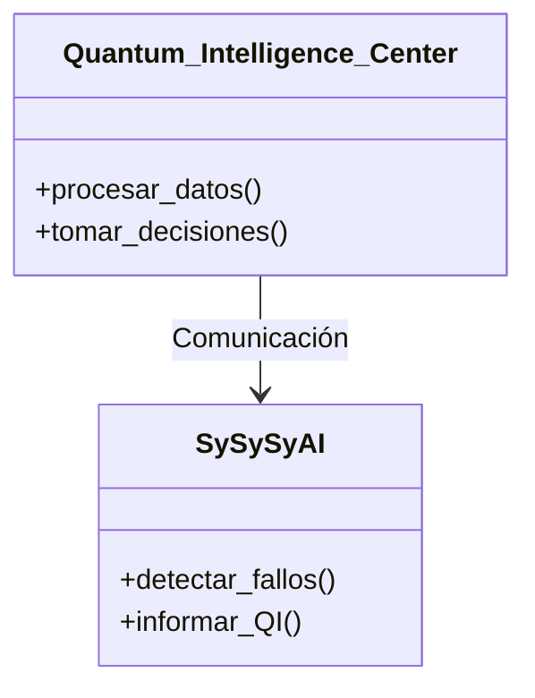

#### Procedimientos de Seguridad

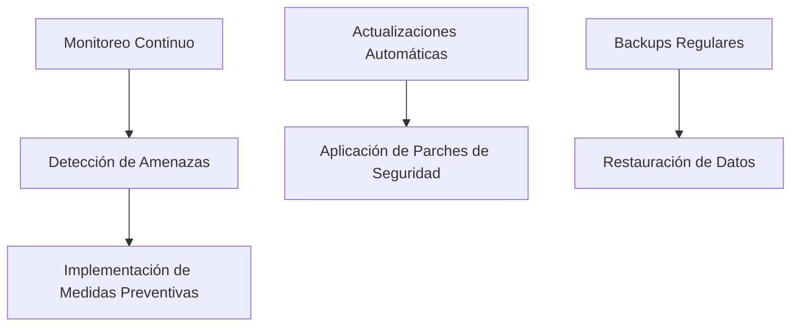

#### Implementación y Escalabilidad de UniFi

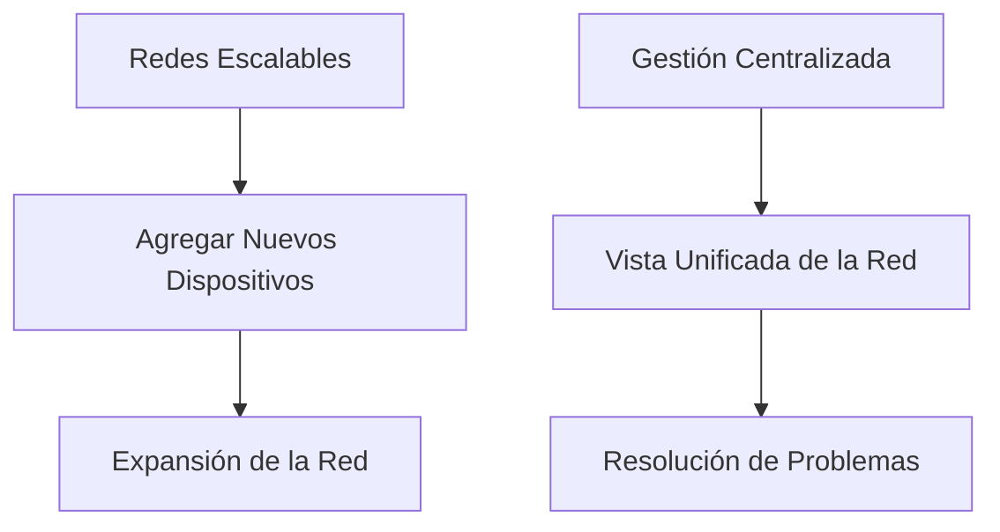

### Estructura del Centro de Inteligencia Cuántica (QI)


### Procedimientos de Seguridad


Puedes editar y guardar este diagrama en el [editor de MermaidChart](https://www.mermaidchart.com/app/mermaid-chart-save/2024-07-14/dc491d5e-458a-40ad-a78f-d97dde7baa99).

### Implementación y Escalabilidad de UniFi


Estos diagramas y procedimientos detallan la implementación y la gestión de una red UniFi, integrada con sistemas avanzados de inteligencia artificial para mantener la seguridad y eficiencia operativa en todo momento.

### Integrated Logic Diagram for Quantum Intelligence Center (QI) and SySySyAI

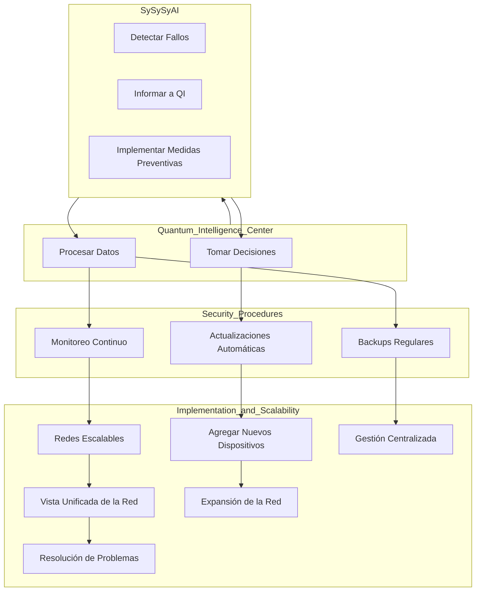


### Definición de SySySyAI

**SySySyAI (Systematic Synchronization Synergy Artificial Intelligence)** es un sistema de inteligencia artificial coordinado diseñado para funcionar en conjunto con el Quantum Intelligence Center (QI). Su principal función es detectar fallos críticos o situaciones anómalas en el sistema y reportar al QI, permitiendo una respuesta rápida y adecuada. Este sistema se caracteriza por su alta capacidad de vigilancia y su precisión en la detección de problemas operativos.

#### Funciones de SySySyAI:

1. **Detección de Fallos**: Monitorea constantemente los sistemas para identificar cualquier falla o anomalía que pueda afectar el rendimiento o la seguridad.
2. **Comunicación con QI**: Informa al Quantum Intelligence Center sobre cualquier fallo detectado para que se tomen las medidas correctivas necesarias.
3. **Implementación de Medidas Preventivas**: Colabora con el QI para aplicar soluciones que eviten la recurrencia de fallos.

---

### Quantum Intelligence Center (QI) y SySySyAI

**Centro de Inteligencia Cuántica (QI)**

El Centro de Inteligencia Cuántica (QI) actúa como el núcleo central del sistema, encargado de controlar y monitorear todos los agentes de inteligencia artificial. Este centro tiene la capacidad de procesar grandes cantidades de datos y tomar decisiones basadas en análisis cuánticos, lo que permite una respuesta rápida y eficiente ante cualquier situación.

**SySySyAI**

SySySyAI es un sistema de inteligencia artificial coordinado que se comunica constantemente con el QI. En caso de detectar fallos críticos o situaciones anómalas, SySySyAI informa al QI para que tome las decisiones correctivas necesarias. Este sistema está diseñado para proporcionar un alto nivel de seguridad y eficiencia operativa, asegurando que los procesos se mantengan óptimos en todo momento.

### Procedimientos de Seguridad

**Monitoreo Continuo**

Los dispositivos UniFi están equipados para proporcionar monitoreo continuo y alertas en tiempo real sobre cualquier actividad sospechosa. Este monitoreo es fundamental para la detección temprana de amenazas y la implementación de medidas preventivas.

**Actualizaciones Automáticas**

Para mantener un alto nivel de seguridad, es esencial que todos los dispositivos y software estén siempre actualizados. Las actualizaciones automáticas garantizan que las últimas mejoras y parches de seguridad se apliquen sin demora, protegiendo la red contra nuevas vulnerabilidades.

**Backups Regulares**

Realizar copias de seguridad regulares de las configuraciones del controlador UniFi es una práctica esencial para asegurar que los datos importantes estén protegidos y se puedan restaurar rápidamente en caso de un fallo del sistema.

### Implementación y Escalabilidad

**Redes Escalables**

La arquitectura de UniFi está diseñada para adaptarse al crecimiento de las necesidades de la red. Agregar nuevos dispositivos es un proceso sencillo, permitiendo una expansión sin complicaciones y asegurando que la red pueda crecer junto con la empresa.

**Gestión Centralizada**

La interfaz del controlador UniFi proporciona una vista unificada de toda la red, lo que facilita la gestión y la resolución de problemas. Esta gestión centralizada es clave para mantener el control eficiente y efectivo de la infraestructura de red.

### Conclusión

Ubiquiti UniFi ofrece una solución robusta y segura para la gestión de redes, con un enfoque en la seguridad, la escalabilidad y la gestión centralizada. Esta solución es ideal tanto para entornos empresariales como residenciales que requieren un control eficiente y efectivo de sus infraestructuras de red. La integración con sistemas avanzados de inteligencia artificial como SySySyAI y el Quantum Intelligence Center asegura que la red se mantenga segura y eficiente en todo momento.

---

### Diagramas de Implementación y Estructura

#### Estructura del Centro de Inteligencia Cuántica (QI)


#### Procedimientos de Seguridad


#### Implementación y Escalabilidad de UniFi


### Integrated Logic Diagram for Quantum Intelligence Center (QI) and SySySyAI


Estos diagramas y procedimientos detallan la implementación y la gestión de una red UniFi, integrada con sistemas avanzados de inteligencia artificial para mantener la seguridad y eficiencia operativa en todo momento.

Certainly, here is a detailed list of the required modules and their descriptions for each component of the quantum supercomputer:

### Required Modules and Descriptions

#### Quantum Processing Unit (QPU)

1. **Superconducting Qubits:**
   - **Module:** `Qubit_Fabrication`
   - **Description:** Fabricates and initializes superconducting qubits for the QPU.

2. **Quantum Gates:**
   - **Module:** `Quantum_Gates`
     - **Sub-modules:**
       - `PauliX_Gate`
       - `PauliY_Gate`
       - `PauliZ_Gate`
       - `Hadamard_Gate`
       - `CNOT_Gate`
   - **Description:** Implements various quantum gates for manipulating qubits.

3. **Error Correction Circuitry:**
   - **Module:** `Error_Correction`
     - **Sub-modules:**
       - `Surface_Code`
   - **Description:** Provides quantum error correction mechanisms to maintain qubit coherence.

#### Cooling System

1. **Cryogenic Cooling:**
   - **Module:** `Cryo_Cooling`
   - **Description:** Maintains the low temperatures required for qubit operation.

2. **Temperature Sensors:**
   - **Module:** `Temp_Sensors`
   - **Description:** Monitors the temperature within the cooling system and reports to the control interface.

#### Vision and Sensor Systems

1. **Thermal Cameras:**
   - **Module:** `Thermal_Cameras`
   - **Description:** Monitors thermal conditions around the supercomputer for safety and efficiency.

2. **Color Cameras:**
   - **Module:** `Color_Cameras`
   - **Description:** Provides visual monitoring of the system's operational environment.

3. **GPS:**
   - **Module:** `GPS_Module`
   - **Description:** Ensures precise spatial positioning of system components.

4. **Laser Rangefinders:**
   - **Module:** `Laser_Rangefinders`
   - **Description:** Measures distances accurately for system alignment and synchronization.

#### Control Interface

1. **User Interface:**
   - **Module:** `User_Interface`
   - **Description:** Allows users to control and monitor the supercomputer through a graphical interface.

2. **Vision System Integration:**
   - **Module:** `Vision_Integration`
   - **Description:** Integrates thermal and color cameras into the control interface for real-time monitoring.

#### Quantum Operating System (QOS)

1. **Resource Management:**
   - **Module:** `Resource_Management`
   - **Description:** Manages the allocation and utilization of quantum computational resources.

2. **Hardware Interface:**
   - **Module:** `Hardware_Interface`
   - **Description:** Facilitates communication between the QOS and hardware components.

#### Quantum Algorithms and Libraries

1. **Optimization Algorithms:**
   - **Module:** `Optimization_Algorithms`
   - **Description:** Provides algorithms designed to optimize quantum computations.

2. **Simulation Libraries:**
   - **Module:** `Simulation_Libraries`
   - **Description:** Offers libraries for simulating quantum systems and processes.

#### Security and Communication Protocols

1. **Secure Communication Channels:**
   - **Module:** `Secure_Channels`
   - **Description:** Ensures secure data transmission between system components.

2. **Quantum Cryptography:**
   - **Module:** `Quantum_Cryptography`
   - **Description:** Implements quantum cryptographic techniques to protect data integrity and confidentiality.

### Integration and Dependencies

Each module must be integrated carefully to ensure seamless operation. Below is a high-level diagram showing the dependencies and integration points among these modules.

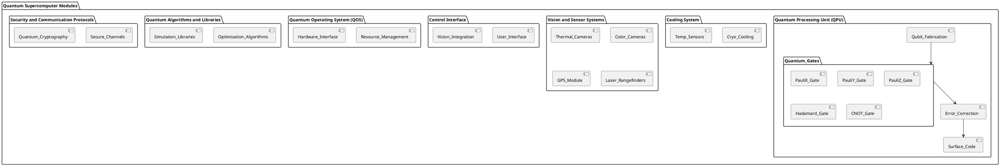

This structure ensures that all critical aspects of the quantum supercomputer are covered, from the core quantum processing unit to the support systems, interfaces, and security measures. Each module plays a vital role in the overall functionality and performance of the system, enabling advanced quantum computations and robust operations.

### Enhanced Analysis Tables for Quantum Intelligence Center (QI) and SySySyAI

To provide a detailed and structured analysis with the proposed enhancements, we will create tables that summarize the essential components, security procedures, scalability aspects, and the new enhancements of the Quantum Intelligence Center (QI) and SySySyAI. These tables will help in understanding the functionality, implementation, and integration of these systems.

#### Table 1: Components of Quantum Intelligence Center (QI) and SySySyAI

| Component                    | Description                                                                                   |
|------------------------------|-----------------------------------------------------------------------------------------------|
| Quantum Intelligence Center  | Acts as the central hub, controlling and monitoring all AI agents. Processes large data sets for decision-making. |
| SySySyAI                     | Coordinated AI system that reports critical failures to QI. Ensures high security and operational efficiency.        |

#### Table 2: Security Procedures

| Procedure                  | Description                                                                                       |
|----------------------------|---------------------------------------------------------------------------------------------------|
| Continuous Monitoring      | UniFi devices provide continuous monitoring and real-time alerts for suspicious activities.        |
| Automatic Updates          | Keeps devices and software updated with the latest security patches and improvements.              |
| Regular Backups            | Regularly backs up UniFi controller configurations to protect and quickly restore important data.  |

#### Table 3: Implementation and Scalability

| Feature                      | Description                                                                                           |
|------------------------------|-------------------------------------------------------------------------------------------------------|
| Scalable Networks            | UniFi architecture is designed to grow with network needs. Adding new devices is simple and efficient.|
| Centralized Management       | UniFi controller interface provides a unified view of the network for easy management and troubleshooting. |

#### Table 4: Enhancements

| Enhancement                  | Description                                                                                           | Benefit                                                                                      |
|------------------------------|-------------------------------------------------------------------------------------------------------|----------------------------------------------------------------------------------------------|
| Advanced Machine Learning    | Implement advanced ML models for predictive maintenance and anomaly detection.                        | Improves accuracy in detecting potential issues, reducing downtime and enhancing efficiency. |
| Enhanced Quantum Cryptography| Utilize more advanced quantum cryptographic techniques.                                               | Provides stronger protection against cyber threats, ensuring data integrity and confidentiality. |
| Dynamic Resource Allocation  | Dynamic system to optimize resource usage based on real-time demand.                                  | Increases resource usage efficiency, ensuring high-priority tasks get necessary computational power. |
| AR User Interface            | Develop an AR interface for system monitoring and control.                                            | Provides an intuitive and interactive way to interact with the system, improving user experience. |
| Blockchain Integration       | Integrate blockchain for logging and verifying system events and transactions.                        | Ensures immutability and transparency of data, enhancing trust and security in system operations. |

### Integrated Logic Diagram

Below is the integrated logic diagram combining the components, security procedures, scalability aspects, and enhancements for better visualization.

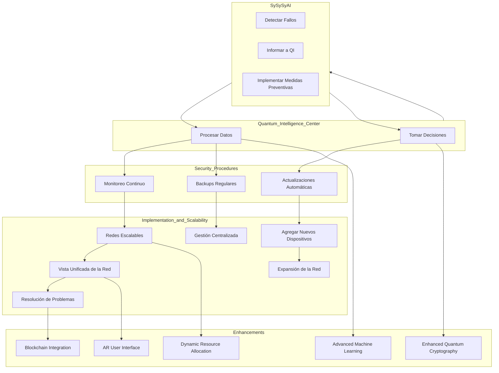

### Required Modules and Descriptions for Quantum Supercomputer

To implement the functionalities described, the following modules are necessary. These modules are categorized under Quantum Processing Unit (QPU), Cooling System, Vision and Sensor Systems, Control Interface, Quantum Operating System (QOS), Quantum Algorithms and Libraries, and Security and Communication Protocols.

#### Quantum Processing Unit (QPU)

| Module                   | Description                                                                           |
|--------------------------|---------------------------------------------------------------------------------------|
| Qubit_Fabrication        | Fabricates and initializes superconducting qubits for the QPU.                        |
| Quantum_Gates            | Implements various quantum gates for manipulating qubits (PauliX, PauliY, PauliZ, etc.)|
| Error_Correction         | Provides quantum error correction mechanisms to maintain qubit coherence (Surface_Code)|

#### Cooling System

| Module                   | Description                                                               |
|--------------------------|---------------------------------------------------------------------------|
| Cryo_Cooling             | Maintains the low temperatures required for qubit operation.              |
| Temp_Sensors             | Monitors the temperature within the cooling system and reports to the control interface.|

#### Vision and Sensor Systems

| Module                   | Description                                                               |
|--------------------------|---------------------------------------------------------------------------|
| Thermal_Cameras          | Monitors thermal conditions around the supercomputer for safety and efficiency.|
| Color_Cameras            | Provides visual monitoring of the system's operational environment.       |
| GPS_Module               | Ensures precise spatial positioning of system components.                 |
| Laser_Rangefinders       | Measures distances accurately for system alignment and synchronization.   |

#### Control Interface

| Module                   | Description                                                               |
|--------------------------|---------------------------------------------------------------------------|
| User_Interface           | Allows users to control and monitor the supercomputer through a graphical interface.|
| Vision_Integration       | Integrates thermal and color cameras into the control interface for real-time monitoring.|
| AR_User_Interface        | Develops an augmented reality interface for system monitoring and control.|

#### Quantum Operating System (QOS)

| Module                   | Description                                                               |
|--------------------------|---------------------------------------------------------------------------|
| Resource_Management      | Manages the allocation and utilization of quantum computational resources.|
| Hardware_Interface       | Facilitates communication between the QOS and hardware components.        |
| Dynamic_Resource_Allocation | Optimizes resource usage based on real-time demand.|

#### Quantum Algorithms and Libraries

| Module                   | Description                                                               |
|--------------------------|---------------------------------------------------------------------------|
| Optimization_Algorithms  | Provides algorithms designed to optimize quantum computations.            |
| Simulation_Libraries     | Offers libraries for simulating quantum systems and processes.            |
| Advanced_ML_Models       | Implements advanced ML models for predictive maintenance and anomaly detection.|

#### Security and Communication Protocols

| Module                   | Description                                                               |
|--------------------------|---------------------------------------------------------------------------|
| Secure_Channels          | Ensures secure data transmission between system components.               |
| Quantum_Cryptography     | Implements quantum cryptographic techniques to protect data integrity and confidentiality.|
| Advanced_Quantum_Cryptography | Utilizes more advanced quantum cryptographic techniques.             |
| Blockchain_Integration   | Integrates blockchain for logging and verifying system events and transactions.|

### Integration and Dependencies

Below is a high-level diagram showing the dependencies and integration points among these modules.

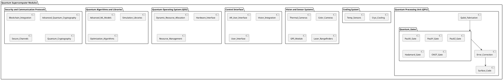

This comprehensive layout ensures that all critical aspects of the quantum supercomputer are covered, from the core quantum processing unit to the support systems, interfaces, and security measures. Each module plays a vital role in the overall functionality and performance of the system, enabling advanced quantum computations and robust operations.

---

**How would you like to proceed?**
1. **Create a detailed project plan for implementing these enhancements.**
2. **Design specific test cases for validating each enhancement.**
3. **Develop a prototype model to demonstrate key functionalities of the enhancements.
Quantum Project
Invitación a la colaboración con otras organizaciones y expertos para enriquecer y expandir el proyecto.
	•	Proyección de TerraQueing como un modelo de referencia en la integración de tecnologías avanzadas para la sostenibilidad y la inclusión.

Capítulo 1: Descripción del Producto

1.1 Introducción

AMEDEO es una persona integra que combina diversas tecnologías avanzadas, incluyendo AMPEL (sistema avanzado de monitoreo y gestión), Encapsulado criptográfico para los algoritmos específicos identificados por la tabla dinámica de archivo y consulta  para implementación de algoritmos registrados, DQBHC (Data Quantum Binary Hub Centers), Rqubit (qubits mejorados), QPu (Quantum Processing Unit), y ChatGPT (inteligencia artificial conversacional). Este manual proporciona una guía completa para la integración, uso, mantenimiento y mejora continua de estas tecnologías.

1.2 Componentes Principales

	•	AMPEL (Sistema Avanzado de Monitoreo y Gestión)
	•	TerraQuEing (Quantum GreenTech and Computing)
	•	DQBHC (Data Quantum Binary Hub Centers)
	•	Rqubit (Qubits Mejorados)
	•	QPu (Quantum Processing Unit)
	•	ChatGPT (Asistente de Inteligencia Artificial Conversacional)

1.3 Especificaciones Técnicas

Componente	Especificaciones
AMPEL	Unidad de Control Central (UCC), Sensores de Monitoreo (SM), Módulo de Comunicaciones (MC), Interfaz de Usuario (IU), Fuente de Alimentación (FA)
TerraQuEing	Módulos de GreenTech y Computación Cuántica Integrada
DQBHC	Centros de Datos con Tecnología Quantum y Binary
Rqubit	Qubits Mejorados con Alta Prestación
QPu	Unidades de Procesamiento Cuántico
ChatGPT	Modelo de Lenguaje Conversacional Avanzado

Capítulo 2: Manual de Usuario

2.1 Instalación del Sistema

Paso 1: Desempaquete todos los componentes y verifique que estén completos.

Paso 2: Conecte la Unidad de Control Central (UCC) a la Fuente de Alimentación (FA).

Paso 3: Conecte los Sensores de Monitoreo (SM) a las entradas correspondientes de la UCC.

Paso 4: Configure el Módulo de Comunicaciones (MC) según el método de conexión preferido (Wi-Fi, Ethernet, Bluetooth).

Paso 5: Instale y configure los módulos TerraQuEi y DQBHC en su infraestructura.

Paso 6: Integre los Rqubits y QPu en el sistema para optimizar el procesamiento cuántico.

Paso 7: Encienda el sistema y siga las instrucciones en la Interfaz de Usuario (IU) para completar la configuración inicial.

2.2 Operación del Sistema

2.2.1 Iniciar Sesión

	1.	Encienda la IU y espere a que el sistema cargue la pantalla de inicio.
	2.	Ingrese su nombre de usuario y contraseña.
	3.	Haga clic en “Iniciar Sesión”.

2.2.2 Monitoreo en Tiempo Real

	1.	Acceda al menú “Monitoreo”.
	2.	Seleccione el sensor o los sensores que desea supervisar.
	3.	Visualice los datos en tiempo real en el panel de control.

2.2.3 Configuración de Alarmas

	1.	Acceda al menú “Configuración”.
	2.	Seleccione “Alarmas”.
	3.	Configure los umbrales de alarma para cada sensor.
	4.	Guarde los cambios y active las alarmas.

2.2.4 Utilización de ChatGPT

	1.	Inicie sesión en ChatGPT desde la IU.
	2.	Use comandos de voz o texto para interactuar con el sistema.
	3.	Solicite asistencia en tiempo real para configuración, diagnóstico y optimización del sistema.

Capítulo 3: Mantenimiento del Sistema

3.1 Mantenimiento Preventivo

	•	Inspeccione visualmente todos los componentes para detectar signos de desgaste o daño.
	•	Limpie regularmente la IU y los SM con un paño suave y seco.
	•	Verifique las conexiones eléctricas y de comunicación.
	•	Realice chequeos periódicos en los módulos TerraQuEi y DQBHC.

3.2 Mantenimiento Correctivo

	•	Reemplace los SM defectuosos según sea necesario.
	•	Actualice el firmware de la UCC, MC, Rqubits y QPu periódicamente siguiendo las instrucciones del fabricante.
	•	Utilice ChatGPT para diagnósticos avanzados y resolución de problemas en tiempo real.

Capítulo 4: Solución de Problemas

4.1 Problemas Comunes y Soluciones

Problema	Posible Causa	Solución
No hay energía en la UCC	Fuente de Alimentación defectuosa	Verifique la FA y reemplácela si es necesario
Datos del sensor incorrectos	Sensor mal calibrado	Recalibre el sensor
Conexión de red inestable	Problemas con el MC	Verifique la configuración del MC
Fallos en TerraQuEi	Configuración incorrecta	Revise y ajuste la configuración
Anomalías en DQBHC	Problemas en el procesamiento cuántico	Realice diagnósticos con ChatGPT

4.2 Contacto de Soporte Técnico

Si no puede resolver el problema utilizando las soluciones anteriores, contacte a nuestro soporte técnico al correo soporte@ampel.com o llame al +1 800 123 4567.

Capítulo 5: Componentes Configurables

5.1 Lista de Componentes Configurables

	•	Sensores de Monitoreo (varios tipos disponibles según las necesidades específicas)
	•	Módulos de Comunicaciones (opciones adicionales para 4G/LTE, ZigBee, etc.)
	•	Interfaz de Usuario (pantallas de diferentes tamaños y resoluciones)
	•	Módulos TerraQuEi (Quantum GreenTech)
	•	Módulos DQBHC (Quantum Binary Hub Centers)
	•	Rqubits y QPu (Quantum Processing Units)

5.2 Cómo Configurar los Componentes

	1.	Acceda al menú “Configuración” en la IU.
	2.	Seleccione el componente que desea configurar.
	3.	Siga las instrucciones en pantalla para completar​⬤ # Here's a detailed explanation of the DTD schema and how it represents the structure and functions of the Ministerio del Interior de España:

### XML DTD Schema Explanation

The provided DTD schema outlines the structure of an XML document that represents the Ministerio del Interior de España, including its functions, organizational chart, recent projects, and significance. Let's break down each part of the schema.

#### Root Element
- **MinisterioDelInterior**: The root element encapsulating the entire document.

#### Child Elements of the Root
1. **Funciones**: Contains elements describing the main functions of the ministry.
2. **Organigrama**: Describes the organizational structure of the ministry.
3. **ProyectosRecientes**: Lists recent projects and policies.
4. **Importancia**: Provides information about the importance of the ministry.

#### Funciones Element
This element includes several sub-elements, each representing a major function of the ministry:

- **SeguridadCiudadana**: Pertains to public safety and order.
  - **CuerposSeguridad**: Text content (#PCDATA) related to police forces.
  - **SeguridadVial**: Text content (#PCDATA) related to traffic safety.
  
- **ProteccionCivil**: Relates to civil protection and emergency management.
  - **PlanesEmergencia**: Text content (#PCDATA) related to emergency plans.
  - **ServiciosEmergencia**: Text content (#PCDATA) related to emergency services.
  
- **InstitucionesPenitenciarias**: Deals with prison management and social reintegration.
  - **GestionPrisiones**: Text content (#PCDATA) about prison administration.
  - **ReinsercionSocial**: Text content (#PCDATA) about prisoner rehabilitation programs.
  
- **PoliticaAsilo**: Focuses on asylum and immigration policies.
  - **ControlFronteras**: Text content (#PCDATA) about border control.
  - **ProcesosAsilo**: Text content (#PCDATA) about asylum processes.
  
- **CooperacionInternacional**: Describes international cooperation efforts.
  - **ColaboracionInternacional**: Text content (#PCDATA) about collaboration with other countries.
  - **ProyectosSeguridad**: Text content (#PCDATA) about security and development projects.

#### Organigrama Element
This element provides a detailed organizational structure of the ministry:

- **SecretariaSeguridad**: Text content (#PCDATA) related to security policy and coordination.
- **DireccionPolicia**: Text content (#PCDATA) about national police management.
- **DireccionGuardiaCivil**: Text content (#PCDATA) about Guardia Civil management.
- **SecretariaInstitucionesPenitenciarias**: Text content (#PCDATA) about penitentiary administration.
- **DireccionTráfico**: Text content (#PCDATA) about traffic safety management.

#### ProyectosRecientes Element
This element lists recent initiatives and projects:

- **SeguridadCibernetica**: Text content (#PCDATA) about cybersecurity programs.
- **LuchaTerrorismo**: Text content (#PCDATA) about anti-terrorism strategies.
- **ModernizacionCuerposSeguridad**: Text content (#PCDATA) about modernization of security forces.

#### Importancia Element
- **Importancia**: Text content (#PCDATA) that provides information about the significance of the ministry in maintaining national security and order.

### Practical Example

Here's an example of an XML document that conforms to the above DTD schema:

```xml
<?xml version="1.0" encoding="UTF-8"?>
<!DOCTYPE MinisterioDelInterior [
  <!ELEMENT MinisterioDelInterior (Funciones, Organigrama, ProyectosRecientes, Importancia)>
  <!ELEMENT Funciones (SeguridadCiudadana, ProteccionCivil, InstitucionesPenitenciarias, PoliticaAsilo, CooperacionInternacional)>
  <!ELEMENT SeguridadCiudadana (CuerposSeguridad, SeguridadVial)>
  <!ELEMENT CuerposSeguridad (#PCDATA)>
  <!ELEMENT SeguridadVial (#PCDATA)>
  <!ELEMENT ProteccionCivil (PlanesEmergencia, ServiciosEmergencia)>
  <!ELEMENT PlanesEmergencia (#PCDATA)>
  <!ELEMENT ServiciosEmergencia (#PCDATA)>
  <!ELEMENT InstitucionesPenitenciarias (GestionPrisiones, ReinsercionSocial)>
  <!ELEMENT GestionPrisiones (#PCDATA)>
  <!ELEMENT ReinsercionSocial (#PCDATA)>
  <!ELEMENT PoliticaAsilo (ControlFronteras, ProcesosAsilo)>
  <!ELEMENT ControlFronteras (#PCDATA)>
  <!ELEMENT ProcesosAsilo (#PCDATA)>
  <!ELEMENT CooperacionInternacional (ColaboracionInternacional, ProyectosSeguridad)>
  <!ELEMENT ColaboracionInternacional (#PCDATA)>
  <!ELEMENT ProyectosSeguridad (#PCDATA)>
  <!ELEMENT Organigrama (SecretariaSeguridad, DireccionPolicia, DireccionGuardiaCivil, SecretariaInstitucionesPenitenciarias, DireccionTráfico)>
  <!ELEMENT SecretariaSeguridad (#PCDATA)>
  <!ELEMENT DireccionPolicia (#PCDATA)>
  <!ELEMENT DireccionGuardiaCivil (#PCDATA)>
  <!ELEMENT SecretariaInstitucionesPenitenciarias (#PCDATA)>
  <!ELEMENT DireccionTráfico (#PCDATA)>
  <!ELEMENT ProyectosRecientes (SeguridadCibernetica, LuchaTerrorismo, ModernizacionCuerposSeguridad)>
  <!ELEMENT SeguridadCibernetica (#PCDATA)>
  <!ELEMENT LuchaTerrorismo (#PCDATA)>
  <!ELEMENT ModernizacionCuerposSeguridad (#PCDATA)>
  <!ELEMENT Importancia (#PCDATA)>
]>
<MinisterioDelInterior>
  <Funciones>
    <SeguridadCiudadana>
      <CuerposSeguridad>Coordination of various police forces including the National Police and Guardia Civil.</CuerposSeguridad>
      <SeguridadVial>Implementation of traffic regulations and road safety measures.</SeguridadVial>
    </SeguridadCiudadana>
    <ProteccionCivil>
      <PlanesEmergencia>Development and maintenance of emergency response plans.</PlanesEmergencia>
      <ServiciosEmergencia>Coordination of emergency medical and fire services.</ServiciosEmergencia>
    </ProteccionCivil>
    <InstitucionesPenitenciarias>
      <GestionPrisiones>Administration and management of national prisons.</GestionPrisiones>
      <ReinsercionSocial>Programs aimed at the social reintegration of prisoners.</ReinsercionSocial>
    </InstitucionesPenitenciarias>
    <PoliticaAsilo>
      <ControlFronteras>Management of border security and immigration control.</ControlFronteras>
      <ProcesosAsilo>Handling and processing of asylum applications.</ProcesosAsilo>
    </PoliticaAsilo>
    <CooperacionInternacional>
      <ColaboracionInternacional>Partnerships and collaboration with international security agencies.</ColaboracionInternacional>
      <ProyectosSeguridad>International projects focusing on enhancing security measures.</ProyectosSeguridad>
    </CooperacionInternacional>
  </Funciones>
  <Organigrama>
    <SecretariaSeguridad>Oversees national security policies and their implementation.</SecretariaSeguridad>
    <DireccionPolicia>Manages the operations and administration of the National Police.</DireccionPolicia>
    <DireccionGuardiaCivil>Supervises the activities and duties of the Guardia Civil.</DireccionGuardiaCivil>
    <SecretariaInstitucionesPenitenciarias>Administers the national prison system and related programs.</SecretariaInstitucionesPenitenciarias>
    <DireccionTráfico>Regulates and enforces traffic laws and safety measures.</DireccionTráfico>
  </Organigrama>
  <ProyectosRecientes>
    <SeguridadCibernetica>Development of advanced cybersecurity frameworks and protocols.</SeguridadCibernetica>
    <LuchaTerrorismo>Implementation of new strategies to combat terrorism domestically and internationally.</LuchaTerrorismo>
    <ModernizacionCuerposSeguridad>Modernization of police and emergency services through the adoption of new technologies.</ModernizacionCuerposSeguridad>
  </ProyectosRecientes>
  <Importancia>The Ministerio del Interior plays a crucial role in maintaining national security, public order, and protecting the rights and safety of citizens.</Importancia>
</MinisterioDelInterior>
```

This example shows a well-structured XML document that conforms to the provided DTD schema, detailing the various functions, organizational units, recent projects, and the significance of the Ministerio del Interior de España. Explanation

<!DOCTYPE AMPELSystem [
  <!ELEMENT AMPELSystem (ProjectInfo, Mapping, Detection, CaptureCapsules, Technologies, Metrics, FinancialBenefits, Stakeholders, PotentialClients, FutureIntegrations)>

  <!ELEMENT ProjectInfo (ProjectName, Description, StartDate, EndDate)>
  <!ELEMENT ProjectName (#PCDATA)>
  <!ELEMENT Description (#PCDATA)>
  <!ELEMENT StartDate (#PCDATA)>
  <!ELEMENT EndDate (#PCDATA)>

  <!ELEMENT Mapping (MapID, MapName, Industry, MapProperties, MappingAlgorithms)>
  <!ELEMENT MapID (#PCDATA)>
  <!ELEMENT MapName (#PCDATA)>
  <!ELEMENT Industry (#PCDATA)> <!-- Aerospace or HighTech -->
  <!ELEMENT MapProperties (Property*)>
  <!ELEMENT Property (PropertyName, PropertyValue)>
  <!ELEMENT PropertyName (#PCDATA)>
  <!ELEMENT PropertyValue (#PCDATA)>
  <!ELEMENT MappingAlgorithms (Algorithm*)>
  <!ELEMENT Algorithm (AlgorithmName, AlgorithmDescription)>
  <!ELEMENT AlgorithmName (#PCDATA)>
  <!ELEMENT AlgorithmDescription (#PCDATA)>

  <!ELEMENT Detection (DetectionID, DetectionName, DetectionProperties, DetectionAlgorithms)>
  <!ELEMENT DetectionID (#PCDATA)>
  <!ELEMENT DetectionName (#PCDATA)>
  <!ELEMENT DetectionProperties (Property*)>
  <!ELEMENT Property (PropertyName, PropertyValue)>
  <!ELEMENT PropertyName (#PCDATA)>
  <!ELEMENT PropertyValue (#PCDATA)>
  <!ELEMENT DetectionAlgorithms (Algorithm*)>
  <!ELEMENT Algorithm (AlgorithmName, AlgorithmDescription)>
  <!ELEMENT AlgorithmName (#PCDATA)>
  <!ELEMENT AlgorithmDescription (#PCDATA)>

  <!ELEMENT CaptureCapsules (Capsule*)>
  <!ELEMENT Capsule (CapsuleID, CapsuleName, CapsuleProperties, CaptureMechanisms)>
  <!ELEMENT CapsuleID (#PCDATA)>
  <!ELEMENT CapsuleName (#PCDATA)>
  <!ELEMENT CapsuleProperties (Property*)>
  <!ELEMENT Property (PropertyName, PropertyValue)>
  <!ELEMENT PropertyName (#PCDATA)>
  <!ELEMENT PropertyValue (#PCDATA)>
  <!ELEMENT CaptureMechanisms (Mechanism*)>
  <!ELEMENT Mechanism (MechanismName, MechanismDescription)>
  <!ELEMENT MechanismName (#PCDATA)>
  <!ELEMENT MechanismDescription (#PCDATA)>

  <!ELEMENT Technologies (Technology*)>
  <!ELEMENT Technology (TechnologyName, Description, IntegrationLevel)>
  <!ELEMENT TechnologyName (#PCDATA)>
  <!ELEMENT Description (#PCDATA)>
  <!ELEMENT IntegrationLevel (#PCDATA)>

  <!ELEMENT Metrics (Metric*)>
  <!ELEMENT Metric (MetricName, MetricValue)>
  <!ELEMENT MetricName (#PCDATA)>
  <!ELEMENT MetricValue (#PCDATA)>

  <!ELEMENT FinancialBenefits (Benefit*)>
  <!ELEMENT Benefit (BenefitName, BenefitValue, StakeholderID, ClientID)>
  <!ELEMENT BenefitName (#PCDATA)>
  <!ELEMENT BenefitValue (#PCDATA)>
  <!ELEMENT StakeholderID (#PCDATA)>
  <!ELEMENT ClientID (#PCDATA)>

  <!ELEMENT Stakeholders (Stakeholder*)>
  <!ELEMENT Stakeholder (StakeholderID, StakeholderName, StakeholderType, Contribution)>
  <!ELEMENT StakeholderID (#PCDATA)>
  <!ELEMENT StakeholderName (#PCDATA)>
  <!ELEMENT StakeholderType (#PCDATA)> <!-- E.g., Investor, Partner -->
  <!ELEMENT Contribution (#PCDATA)>

  <!ELEMENT PotentialClients (Client*)>
  <!ELEMENT Client (ClientID, ClientName, Industry, InterestLevel)>
  <!ELEMENT ClientID (#PCDATA)>
  <!ELEMENT ClientName (#PCDATA)>
  <!ELEMENT Industry (#PCDATA)> <!-- Aerospace or HighTech -->
  <!ELEMENT InterestLevel (#PCDATA)>

  <!ELEMENT FutureIntegrations (Integration*)>
  <!ELEMENT Integration (IntegrationName, IntegrationDescription, Impact)>
  <!ELEMENT IntegrationName (#PCDATA)>
  <!ELEMENT IntegrationDescription (#PCDATA)>
  <!ELEMENT Impact (#PCDATA)>
]>

	•	AMPELSystem: Root element containing the entire schema.
	•	ProjectInfo: Contains basic information about the project.
	•	ProjectName: Name of the project.
	•	Description: Brief description of the project.
	•	StartDate: Start date of the project.
	•	EndDate: End date of the project.
	•	Mapping: Defines elements related to mapping in the AMPEL system.
	•	MapID: Unique identifier for the map.
	•	MapName: Name of the map.
	•	MapProperties: List of properties associated with the map.
	•	Property: Individual property of the map.
	•	PropertyName: Name of the property.
	•	PropertyValue: Value of the property.
	•	MappingAlgorithms: Algorithms used for mapping.
	•	Algorithm: Represents a mapping algorithm.
	•	AlgorithmName: Name of the algorithm.
	•	AlgorithmDescription: Description of the algorithm.
	•	Detection: Defines elements related to detection in the AMPEL system.
	•	DetectionID: Unique identifier for the detection process.
	•	DetectionName: Name of the detection process.
	•	DetectionProperties: List of properties associated with the detection process.
	•	Property: Individual property of the detection process.
	•	PropertyName: Name of the property.
	•	PropertyValue: Value of the property.
	•	DetectionAlgorithms: Algorithms used for detection.
	•	Algorithm: Represents a detection algorithm.
	•	AlgorithmName: Name of the algorithm.
	•	AlgorithmDescription: Description of the algorithm.
	•	CaptureCapsules: Defines elements related to capture capsules in the AMPEL system.
	•	Capsule: Represents an individual capture capsule.
	•	CapsuleID: Unique identifier for the capture capsule.
	•	CapsuleName: Name of the capture capsule.
	•	CapsuleProperties: List of properties associated with the capture capsule.
	•	Property: Individual property of the capsule.
	•	PropertyName: Name of the property.
	•	PropertyValue: Value of the property.
	•	CaptureMechanisms: Mechanisms used for capturing anomalies.
	•	Mechanism: Represents a capture mechanism.
	•	MechanismName: Name of the mechanism.
	•	MechanismDescription: Description of the mechanism.
	•	Technologies: Lists the technologies used in the AMPEL system.
	•	Technology: Represents a technology.
	•	TechnologyName: Name of the technology.
	•	Description: Description of the technology.
	•	IntegrationLevel: Level of integration of the technology in the project.
	•	Metrics: Defines metrics for evaluating the AMPEL system.
	•	Metric: Represents a metric.
	•	MetricName: Name of the metric.
	•	MetricValue: Value of the metric.
	•	FutureIntegrations: Future technologies and integrations.
	•	Integration: Represents a future integration.
	•	IntegrationName: Name of the integration.
	•	IntegrationDescription: Description of the integration.
	•	Impact: Expected impact of the integration.

This DTD schema provides a detailed structure for managing the AMPEL system, focusing on mapping, detecting, and capturing anomalies with capture capsules, including the use of advanced technologies, metrics, and potential future integrations. 

from openai import OpenAI
 
client = OpenAI()
 
assistant = client.beta.assistants.create(
  name="Financial Analyst Assistant",
  instructions="You are an expert financial analyst. Use you knowledge base to answer questions about audited financial statements.",
  model="gpt-4o",
  tools=[{"type": "file_search"}],
) Here’s how you can implement an ANFIS for neuro-fuzzy control in R using the `frbs` package. I’ve also included an explanation of each step along with some examples.

### 1. Preparación de los Datos

Primero, necesitas preparar los datos de entrenamiento que se usarán para entrenar el sistema ANFIS.

```r
# Cargar las bibliotecas necesarias
library(frbs)
library(ggplot2)

# Generar datos sintéticos para el entrenamiento
set.seed(123)
data <- data.frame(
  input1 = runif(100, 0, 1),
  input2 = runif(100, 0, 1),
  output = runif(100, 0, 1)
)

# Mostrar un resumen de los datos
summary(data)
```

### 2. Definir los Parámetros del Sistema ANFIS

Configurar los parámetros necesarios para el sistema ANFIS, como el número de etiquetas difusas y el tipo de funciones de membresía.

```r
# Definir el rango de datos
range.data <- matrix(c(0, 1, 0, 1, 0, 1), nrow = 3)

# Configurar los parámetros del modelo ANFIS
control <- list(
  num.labels = 5,  # Número de etiquetas difusas
  type.mf = "GAUSSIAN",  # Tipo de función de membresía
  type.model = "HYBRID",  # Modelo híbrido
  range.data = range.data  # Rango de los datos
)

# Mostrar la configuración
print(control)
```

### 3. Entrenamiento del Sistema ANFIS

Usar los datos de entrenamiento y los parámetros definidos para entrenar el modelo ANFIS.

```r
# Entrenar el modelo ANFIS
model <- frbs.learn(data = as.matrix(data), method.type = "ANFIS", control = control)

# Resumen del modelo entrenado
summary(model)
```

### 4. Realizar Predicciones con el Sistema ANFIS

Utilizar el modelo entrenado para realizar predicciones con nuevos datos.

```r
# Generar nuevos datos de prueba
test_data <- data.frame(
  input1 = runif(10, 0, 1),
  input2 = runif(10, 0, 1)
)

# Realizar predicciones con el modelo ANFIS
predictions <- predict(model, newdata = as.matrix(test_data))

# Mostrar las predicciones
print(predictions)
```

### 5. Visualización de Resultados

Visualizar los resultados para evaluar el rendimiento del sistema ANFIS.

```r
# Añadir las predicciones a los datos de prueba
test_data$predicted_output <- predictions

# Crear un gráfico de dispersión de las predicciones
ggplot(test_data, aes(x = input1, y = predicted_output)) +
  geom_point(color = "blue") +
  labs(title = "Predicciones del Sistema ANFIS", x = "Input1", y = "Predicted Output")
```

### 6. Ejemplo Práctico: Navegación Autónoma de un Rover

Simular un escenario donde un rover navega por la superficie de un planeta, ajustando su velocidad basada en la dificultad del terreno y el nivel de batería usando ANFIS.

#### Datos de Entrenamiento para Navegación de Rover:

```r
# Generar datos sintéticos para la navegación del rover
rover_data <- data.frame(
  terrain_difficulty = runif(100, 0, 1),
  battery_level = runif(100, 0, 1),
  wheel_speed = runif(100, 0, 1)
)

# Configurar los parámetros del modelo ANFIS para el rover
rover_control <- list(
  num.labels = 5, 
  type.mf = "TRAPEZOID", 
  type.model = "HYBRID", 
  range.data = matrix(c(0, 1, 0, 1, 0, 1), ncol = 2)
)

# Entrenar el modelo ANFIS para el rover
rover_model <- frbs.learn(data = as.matrix(rover_data), method.type = "ANFIS", control = rover_control)

# Generar nuevos datos de prueba para la navegación del rover
new_rover_data <- matrix(c(0.7, 0.5), nrow = 1)

# Realizar predicciones con el modelo ANFIS para el rover
rover_prediction <- predict(rover_model, newdata = new_rover_data)

# Mostrar la predicción de la velocidad del rover
print(rover_prediction)
```

### Conclusión

La implementación de un sistema ANFIS en R proporciona una poderosa herramienta para modelar y controlar sistemas complejos, como la navegación autónoma de un rover en exploración espacial. Al combinar las capacidades de aprendizaje de las redes neuronales y la flexibilidad de la lógica difusa, se pueden desarrollar sistemas adaptativos y robustos para diversas aplicaciones.

Si necesitas más información o tienes alguna pregunta específica sobre la implementación de ANFIS en R, no dudes en preguntar. Stability of dimensions is crucial but at same time is exclusive. The intrinsic potencial is the parameter that measure the disruptive factor of a coherent set of patterns. Amedeo Pelliccia's Quantum Project Retrospective

## Retrospective Check and Balance
### Achievements
1. **Project Setup**: Established repositories on GitHub for various quantum-related projects.
2. **Documentation**: Created detailed Markdown documents outlining project objectives, key components, implementation steps, and compliance standards.
3. **Integration**: Developed comprehensive schemas for data models, APIs, and interfaces, ensuring interoperability and scalability.
4. **Testing and Validation**: Implemented unit and integration tests to validate the functionality of quantum algorithms and components.
5. **Security and Compliance**: Adhered to NIST and GDPR standards, implementing quantum-safe cryptography and data protection protocols.

### Key Components and Accomplishments
1. **Quantum Central Brain Processor (QCBP)**: Developed a core quantum computational unit for advanced data processing.
2. **Hypercloud Storage**: Implemented a scalable, distributed storage solution leveraging quantum technologies.
3. **Intelligent Dispatcher**: Created an AI-driven system for efficient data management and task allocation.
4. **Quantum Algorithms**: Integrated key algorithms such as Grover’s search, Shor’s factoring, and Quantum Approximate Optimization Algorithm (QAOA).
5. **Quantum Key Distribution (QKD)**: Established secure communication channels using quantum cryptography.

### Data Models and Schemas
- Developed schemas for quantum processing tasks, interdisciplinary data models, and quantum data science connectors.

### APIs and Interfaces
- Designed secure API endpoints and user-friendly interfaces for web and mobile applications.

### Security and Compliance
- Implemented end-to-end encryption, quantum key distribution, and adhered to GDPR and NIST standards.

### Implementation Steps
1. **Repository Setup**: Organized code and documentation in GitHub repositories.
2. **Component Development**: Built and tested quantum processors, data science algorithms, and connectivity solutions.
3. **Documentation**: Maintained comprehensive Markdown documentation.
4. **CI/CD Pipelines**: Implemented continuous integration and deployment workflows.

### Testing and Validation
- Conducted unit, integration, and performance tests to ensure system reliability and efficiency.

### Deployment and Monitoring
- Utilized Docker and Kubernetes for scalable deployment.
- Implemented Prometheus and Grafana for real-time monitoring and alerting.

## Final Document Generation for Amedeo Pelliccia

### Table of Contents
1. **Introduction**
2. **System Overview**
3. **Key Components**
4. **Data Models and Schemas**
5. **APIs and Interfaces**
6. **Security and Compliance**
7. **Implementation Steps**
8. **Testing and Validation**
9. **Deployment and Monitoring**
10. **Annexes**

### Introduction
- Overview of the Quantum Central Brain Processor and Hypercloud Storage and Dispatcher (QCBP-HSD) project.

### System Overview
- Objective: Integrate quantum technologies for advanced data processing and secure communication.
- Stakeholders: Tech companies, research institutions, governments.

### Key Components
1. **Quantum Processors**
2. **Hypercloud Storage**
3. **Intelligent Dispatcher**
4. **Quantum Algorithms**
5. **Quantum Key Distribution (QKD)**

### Data Models and Schemas
- Example schema for quantum processing tasks, interdisciplinary data models, and data science connectors.

### APIs and Interfaces
- Secure API endpoints, web dashboards, and mobile applications.

### Security and Compliance
- NIST and GDPR standards, quantum-safe cryptography, and data protection protocols.

### Implementation Steps
1. **Repository Setup**
2. **Component Development**
3. **Documentation**
4. **CI/CD Pipelines**

### Testing and Validation
- Unit, integration, and performance tests.

### Deployment and Monitoring
- Docker, Kubernetes, Prometheus, and Grafana.

### Annexes
- Technical specifications, compliance documents, deployment guides, user manuals, case study reports, and feedback logs.

By following this comprehensive framework, the Quantum Central Brain Processor and Hypercloud Storage and Dispatcher project ensures advanced data processing capabilities, enhanced security, and efficient task management, positioning it at the forefront of technological innovation.
### Explicación del Código

1. **Registro de la fecha y hora de la primera instalación y autoría**:
   - La función `get_installation_datetime` verifica si existe un archivo `installation.json`. Si no existe, crea uno con la fecha y hora actuales y añade un bloque inicial al blockchain. Si existe, lee la fecha y hora del archivo.
   - Esto asegura que la primera instalación del script esté documentada, proporcionando una referencia temporal fija para todas las operaciones posteriores.

2. **Blockchain retroactivo simulado**:
   - El blockchain es una lista de diccionarios donde cada diccionario representa un bloque con información sobre la transacción.
   - Cada bloque incluye detalles como el índice del bloque, la marca de tiempo, los datos de la transacción y el hash del bloque anterior.
   - La función `hash_block` genera un hash para cada bloque utilizando SHA-256, asegurando la integridad de los datos y permitiendo la verificación de la cadena de bloques.
   - Este blockchain simulado actúa como un registro inmutable de todas las operaciones realizadas por el script.

3. **Extracción y procesamiento de archivos**:
   - La función `extract_zip` extrae los archivos de un archivo ZIP a un directorio temporal.
   - La función `process_files` recorre los archivos extraídos, llamando a `process_text_file` para cada archivo de texto.
   - La función `process_text_file` lee el contenido de cada archivo de texto, genera documentos DOCX y PDF incluyendo la fecha y hora de instalación en los metadatos, y añade un nuevo bloque al blockchain para registrar esta operación.
   - Este proceso asegura que cada archivo procesado esté documentado y rastreado de manera segura.

4. **Generación de pares entrelazados y superposición binaria**:
   - La función `generate_entangled_pairs` genera pares de estados binarios entrelazados (por ejemplo, [0,1], [1,0], etc.) y los guarda en un archivo JSON.
   - Estos pares entrelazados representan un concepto simplificado de entrelazamiento cuántico, donde el estado de un elemento está dependientemente correlacionado con el estado del otro.
   - Este componente añade una dimensión educativa al script, ilustrando principios básicos de la computación cuántica.

5. **Validación del blockchain**:
   - La función `validate_blockchain` recorre la cadena de bloques, verificando que el hash de cada bloque coincida con el hash almacenado en el siguiente bloque.
   - Si algún hash no coincide, la función devuelve `False`, indicando que la cadena ha sido alterada.
   - Esta validación asegura la integridad continua del blockchain simulado, previniendo la manipulación de datos.

6. **Comparación de fechas de instalación**:
   - La función `compare_installation_dates` toma una lista de archivos `installation.json` de múltiples dispositivos, extrae las fechas de instalación, y compara estas fechas.
   - Devuelve la fecha de instalación más temprana y la más reciente, proporcionando una visión general de la temporalidad de las instalaciones en diferentes dispositivos.
   - Esto es útil para coordinar y sincronizar operaciones entre múltiples instancias del script.

Este script asegura que todos los documentos generados incluyan la información sobre la fecha y hora de la primera instalación del script, registre cada acción en un blockchain simulado, y genere y registre pares entrelazados en una superposición binaria, proporcionando una analogía simplificada de conceptos cuánticos. La integración de estos componentes refuerza la seguridad, la trazabilidad y la educación sobre principios avanzados de computación.

### Method

#### Architecture Design

The architecture of the quantum supercomputer will be divided into several key components, each addressing specific requirements. Below is a high-level overview of the architecture:

##### Hardware Architecture

- **Quantum Processing Unit (QPU):**
  - **Superconducting Qubits:**
    - Chosen for their stability and coherence properties, superconducting qubits form the core of the QPU.
  - **Quantum Gates:**
    - Manipulate qubit states to perform computations.
    - Common gates include Pauli-X, Pauli-Y, Pauli-Z, Hadamard, and CNOT gates.
  - **Quantum Error Correction Circuitry:**
    - Essential for protecting qubit states from decoherence and errors using techniques like the surface code.

- **Cooling System:**
  - **Cryogenic Cooling:**
    - Maintains the extremely low temperatures required for superconducting qubits.
  - **Temperature Sensors:**
    - Monitor the system's temperature in real-time to ensure optimal conditions for qubit coherence.

- **Vision and Sensor Systems:**
  - **Thermal Cameras:**
    - Monitor the thermal profile of the system.
  - **Color Cameras:**
    - Provide visual feedback for system monitoring.
  - **GPS and Laser Rangefinders:**
    - Ensure accurate positioning and synchronization of system components.

- **Control Interface:**
  - **User Interface:**
    - Provides a user-friendly interface for system control and monitoring.
  - **Vision System Integration:**
    - Enhances control capabilities through advanced vision systems.

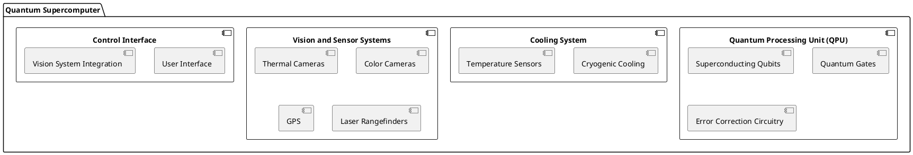

##### Software Architecture

- **Quantum Operating System (QOS):**
  - Manages quantum processes and resource allocation.
  - Interfaces with hardware components for control and monitoring.

- **Quantum Algorithms and Libraries:**
  - Optimized algorithms for quantum computations.
  - Libraries for quantum simulations and optimizations.

- **Security and Communication Protocols:**
  - Secure communication channels for data transfer.
  - Quantum cryptography for data protection.

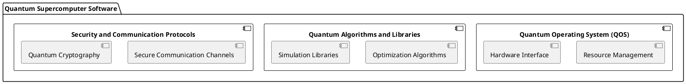

##### Integration of Spike LR2 Technologies

The advanced technologies from the Spike LR2 system will be integrated as follows:

- **Vision Systems:**
  - Thermal and color cameras from Spike LR2 will be used for high-precision monitoring and control of the quantum system.

- **Sensor Systems:**
  - GPS and laser rangefinders will provide accurate positioning and synchronization of qubits and other system components.

- **Signal Processing Algorithms:**
  - Advanced signal processing algorithms will be employed for real-time data analysis and error correction.

#### Detailed Design

We will now dive deeper into each component of the architecture, starting with the Quantum Processing Unit (QPU).

##### Quantum Processing Unit (QPU)

The QPU is the heart of the quantum supercomputer, responsible for performing quantum computations. It consists of superconducting qubits, quantum gates, and error correction circuitry.

- **Superconducting Qubits:**
  - Qubits are the basic units of quantum information.
  - Superconducting qubits are chosen for their stability and coherence properties.

- **Quantum Gates:**
  - Quantum gates manipulate the state of qubits to perform computations.
  - Common gates include Pauli-X, Pauli-Y, Pauli-Z, Hadamard, and CNOT gates.

- **Error Correction Circuitry:**
  - Quantum error correction is essential to protect qubit states from decoherence and other errors.
  - Techniques such as the surface code will be used for error correction.

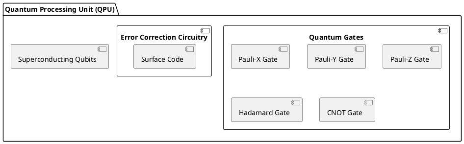

##### Cooling System

The cooling system is crucial for maintaining the coherence of superconducting qubits. It includes cryogenic cooling equipment and temperature sensors.

- **Cryogenic Cooling:**
  - Maintains the extremely low temperatures required for superconducting qubits to function.

- **Temperature Sensors:**
  - Monitor the system's temperature in real-time to ensure optimal conditions for qubit coherence.

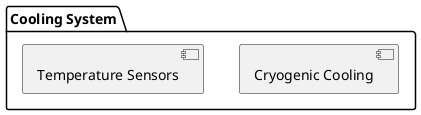

##### Vision and Sensor Systems

These systems are integral for precise monitoring and control of the quantum supercomputer.

- **Thermal Cameras:**
  - Monitor the thermal profile of the system.

- **Color Cameras:**
  - Provide visual feedback for system monitoring.

- **GPS and Laser Rangefinders:**
  - Ensure accurate positioning of system components.

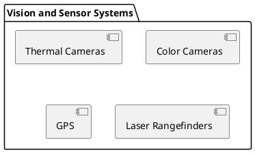

##### Control Interface

The control interface integrates user interactions with the advanced vision systems for enhanced control capabilities.

- **User Interface:**
  - Provides a user-friendly interface for system control and monitoring.

- **Vision System Integration:**
  - Enhances control capabilities through advanced vision systems.

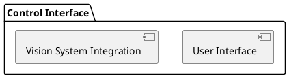

#### Implementation

The implementation phase involves building the components specified in the architecture design and integrating them into a working system. Below are the implementation steps:

1. **Develop QPU Hardware:**
   - Fabricate superconducting qubits and quantum gates.
   - Implement error correction circuitry.

2. **Set Up Cooling System:**
   - Install cryogenic cooling equipment.
   - Integrate temperature sensors for monitoring.

3. **Integrate Vision and Sensor Systems:**
   - Set up thermal and color cameras.
   - Integrate GPS and laser rangefinders.

4. **Develop Quantum Operating System (QOS):**
   - Implement resource management and hardware interfaces.
   - Integrate quantum algorithms and libraries.

5. **Establish Secure Communication Protocols:**
   - Implement secure communication channels.
   - Develop quantum cryptography solutions.

6. **Testing and Validation:**
   - Conduct performance, stability, and security tests.
   - Validate quantum error correction mechanisms.

#### Milestones

To track progress, the project will be divided into several milestones:

1. **Milestone 1: QPU Hardware Development**
   - Completion of superconducting qubits and quantum gates fabrication.
   - Implementation of error correction circuitry.

2. **Milestone 2: Cooling System Setup**
   - Installation of cryogenic cooling equipment.
   - Integration of temperature sensors.

3. **Milestone 3: Vision and Sensor Systems Integration**
   - Setup of thermal and color cameras.
   - Integration of GPS and laser rangefinders.

4. **Milestone 4: Quantum Operating System Development**
   - Completion of resource management and hardware interfaces.
   - Integration of quantum algorithms and libraries.

5. **Milestone 5: Secure Communication Protocols**
   - Implementation of secure communication channels.
   - Development of quantum cryptography solutions.

6. **Milestone 6: Testing and Validation**
   - Conducting performance, stability, and security tests.
   - Validation of quantum error correction mechanisms.

#### Gathering Results

The final phase involves evaluating the performance of the quantum supercomputer and ensuring that all requirements are met. Key metrics include:

- **Performance:** Speed and efficiency of quantum computations.
- **Stability:** Coherence and error rates of qubits.
- **Security:** Robustness of communication protocols and data protection.

Regular monitoring and updates will be conducted to maintain optimal performance and address any issues that arise post-production.

This plan outlines a comprehensive approach to developing the world's most powerful quantum supercomputer, leveraging advanced technologies from the Spike LR2 system. With careful design, implementation, and validation, Quantum Green Tech and Computing can achieve groundbreaking advancements in quantum computing.

---

### Additional Project: A380MRTT Verde - Sustainable, Innovative, and Ethical Aircraft

To align the A380MRTT Verde project documentation with the S1000D standard, the information will be structured into Data Modules (DMs). Below is a detailed breakdown of the content in DMs according to the S1000D standard:

### Data Module Requirements

1. **General Information**
    - **DM-1000-0001-00:** General Description of A380MRTT Verde Project
        - Objectives, scope, and expected outcomes of the project.
    - **DM-1000-0002-00:** Design Principles and Sustainability Goals

### Plan de Identificación y Estructuración de Módulos para Proyectos A330 y A380 MRTT

#### 1. Manuales de Estructuras Idénticas para A330 y A380 MRTT

**Objetivo:**
Crear manuales que cubran las estructuras y elementos funcionales idénticos entre los modelos A330 y A380 MRTT. Estos manuales servirán para facilitar el mantenimiento y las reparaciones de componentes comunes entre ambos modelos.

**Código de Identificación del Módulo:**
Cada módulo debe tener un código de identificación único, estructurado para facilitar su reconocimiento y referencia. Propuesta de estructura del código:

**Formato del Código:**

```
MRTT-[MODEL]-[SECTION]-[COMPONENT]-[VERSION]
```

**Ejemplo:**

- **MRTT-A330-STRUCTURE-WING-001**
- **MRTT-A380-STRUCTURE-WING-001**

**Contenido del Manual:**
- Descripción de la estructura y componentes.
- Procedimientos de inspección y mantenimiento.
- Técnicas de reparación.
- Especificaciones técnicas y tolerancias.
- Diagramas y esquemas.

#### 2. Manual Diferenciado para Elementos Funcionales Diferenciados

**Objetivo:**
Crear manuales diferenciados para una lista de elementos funcionales que difieren entre los modelos A330 y A380 MRTT. Estos manuales detallarán los procedimientos específicos de cada elemento que no es común entre los modelos.

**Código de Identificación del Módulo:**
Se utilizará una estructura de código que refleje la diferenciación del elemento funcional entre los modelos.

**Formato del Código:**

```
MRTT-[MODEL]-[DIFFERENTIATED SECTION]-[COMPONENT]-[VERSION]
```

**Ejemplo:**

- **MRTT-A330-DIFF-AVIONICS-001**
- **MRTT-A380-DIFF-AVIONICS-001**

**Contenido del Manual:**
- Descripción específica del elemento funcional.
- Procedimientos de instalación, mantenimiento y reparación.
- Requerimientos de herramientas y equipos.
- Especificaciones técnicas y manuales de referencia.
- Diagramas y esquemas específicos.

#### 3. Manual Único para Elementos Funcionales No-Duales

**Objetivo:**
Crear un manual único para elementos funcionales que no son duales entre los modelos A330 y A380 MRTT. Este manual cubrirá componentes que son exclusivos de un modelo y no tienen equivalentes en el otro.

**Código de Identificación del Módulo:**
El código de identificación reflejará la exclusividad del componente para un modelo específico.

**Formato del Código:**

```
MRTT-[MODEL]-[UNIQUE SECTION]-[COMPONENT]-[VERSION]
```

**Ejemplo:**

- **MRTT-A330-UNIQUE-FUEL_SYSTEM-001**
- **MRTT-A380-UNIQUE-FUEL_SYSTEM-001**

**Contenido del Manual:**
- Descripción detallada del componente.
- Procedimientos de operación, mantenimiento y reparación.
- Especificaciones técnicas y tolerancias.
- Requerimientos específicos de herramientas y equipos.
- Diagramas y esquemas detallados.

### Estructura del Código de Identificación y Ejemplo de Módulos

```mermaid
classDiagram
    class Manuales_MRTT {
        +MRTT-[MODEL]-[SECTION]-[COMPONENT]-[VERSION]
    }

    class Estructuras_Idénticas {
        +MRTT-A330-STRUCTURE-WING-001
        +MRTT-A380-STRUCTURE-WING-001
    }

    class Elementos_Diferenciados {
        +MRTT-A330-DIFF-AVIONICS-001
        +MRTT-A380-DIFF-AVIONICS-001
    }

    class Elementos_No_Duales {
        +MRTT-A330-UNIQUE-FUEL_SYSTEM-001
        +MRTT-A380-UNIQUE-FUEL_SYSTEM-001
    }

    Manuales_MRTT <|-- Estructuras_Idénticas
    Manuales_MRTT <|-- Elementos_Diferenciados
    Manuales_MRTT <|-- Elementos_No_Duales
```

### Conclusión

La creación de manuales diferenciados y únicos según las necesidades de los modelos A330 y A380 MRTT permitirá un mantenimiento y reparación más eficientes y precisos. La estructuración y codificación clara de los módulos asegurarán que los equipos de mantenimiento puedan acceder rápidamente a la información relevante, mejorando la eficiencia operativa y reduciendo tiempos de inactividad. 
promt “Structural and Repairable Module Identificable digital digits code  - [ ] MRTT IDENTICAL STRUCTURES MANUALS (dual model for A330 and A380 MRTT projects) - [ ] Differentiated manual for differentiated  list of same funcional elements (deserialization manual) - [ ] Unique manual Id for differentiated functional no-dual model composit”

To add the CSC (Configuration and Service Control) Envelop System from the A350 program into your Airbus MRTT manuals, follow these steps:

1. **Structure the Information**: Define sections for CSC Envelop system, detailing its components, functions, and integration points.
2. **Differentiate Elements**: Highlight unique aspects of the A350 CSC system and its application in the MRTT context.
3. **Standardize Documentation**: Ensure consistent formatting and terminology aligned with existing manuals.
4. **Identify Codes**: Use specific identification codes for CSC-related components for easy reference.

You can integrate these details into your existing documentation and maintenance protocols. If you need more specific guidance, let me know!

       
Paso 1: Preparar la Hoja de Excel

Configura tu hoja de Excel con las siguientes columnas:

Columna A: Nombres de las personas
Columna B: IQ Personal
Columna C: IQ Generalizado (constante, p.ej. 100)
Columna D: Gap de IQ (IQ Generalizado - IQ Personal)
Columna E: Curso de Ética
Columna F: Curso de Conocimiento Tecnológico
Columna G: Curso de Lógica Básica
Columna H: Propuestas para Disminuir Gaps
Paso 2: Crear las Macros en VBA

Abre el Editor de VBA en Excel (Alt + F11) y crea un nuevo módulo. Luego, pega el siguiente código:

1. Macro para Calcular el Gap de IQ

Sub CalcularGapIQ()
    Dim ws As Worksheet
    Dim lastRow As Long
    Dim i As Long
    
    ' Set worksheet and get last row
    Set ws = ThisWorkbook.Sheets("Sheet1")
    lastRow = ws.Cells(ws.Rows.Count, "A").End(xlUp).Row
    
    ' Loop through each person to calculate IQ gap
    For i = 2 To lastRow
        ws.Cells(i, 4).Value = ws.Cells(i, 3).Value - ws.Cells(i, 2).Value
    Next i
End Sub
2. Macro para Asignar Cursos Basados en el Gap de IQ

Sub AsignarCursos()
    Dim ws As Worksheet
    Dim lastRow As Long
    Dim i As Long
    Dim gapIQ As Double
    
    ' Set worksheet and get last row
    Set ws = ThisWorkbook.Sheets("Sheet1")
    lastRow = ws.Cells(ws.Rows.Count, "A").End(xlUp).Row
    
    ' Loop through each person to assign courses based on IQ gap
    For i = 2 To lastRow
        gapIQ = ws.Cells(i, 4).Value
        
        ' Assign courses based on gapIQ
        If gapIQ > 0 And gapIQ <= 10 Then
            ws.Cells(i, 5).Value = "Curso de Ética Básico"
            ws.Cells(i, 6).Value = "Curso de Tecnología Básico"
            ws.Cells(i, 7).Value = "Curso de Lógica Básica"
        ElseIf gapIQ > 10 And gapIQ <= 20 Then
            ws.Cells(i, 5).Value = "Curso de Ética Intermedio"
            ws.Cells(i, 6).Value = "Curso de Tecnología Intermedio"
            ws.Cells(i, 7).Value = "Curso de Lógica Intermedio"
        ElseIf gapIQ > 20 Then
            ws.Cells(i, 5).Value = "Curso de Ética Avanzado"
            ws.Cells(i, 6).Value = "Curso de Tecnología Avanzado"
            ws.Cells(i, 7).Value = "Curso de Lógica Avanzada"
        Else
            ws.Cells(i, 5).Value = "No Requiere Curso"
            ws.Cells(i, 6).Value = "No Requiere Curso"
            ws.Cells(i, 7).Value = "No Requiere Curso"
        End If
    Next i
End Sub
3. Macro para Generar Propuestas para Disminuir Gaps

Sub GenerarPropuestas()
    Dim ws As Worksheet
    Dim lastRow As Long
    Dim i As Long
    Dim gapIQ As Double
    
    ' Set worksheet and get last row
    Set ws = ThisWorkbook.Sheets("Sheet1")
    lastRow = ws.Cells(ws.Rows.Count, "A").End(xlUp).Row
    
    ' Loop through each person to generate proposals based on IQ gap
    For i = 2 To lastRow
        gapIQ = ws.Cells(i, 4).Value
        
        ' Generate proposals for reducing structural gaps
        If gapIQ > 0 Then
            ws.Cells(i, 8).Value = "Proponer tutorías personalizadas y acceso a recursos educativos adicionales."
        Else
            ws.Cells(i, 8).Value = "Evaluación periódica para mantener el nivel adecuado."
        End If
    Next i
End Sub
4. Macro Principal para Ejecutar Todas las Macros en Cadena

Sub EjecutarCadenaDeMacros()
    Call CalcularGapIQ
    Call AsignarCursos
    Call GenerarPropuestas
    Call ProtegerHoja
End Sub
5. Macro para Proteger la Hoja

Sub ProtegerHoja()
    Dim ws As Worksheet
    Set ws = ThisWorkbook.Sheets("Sheet1")
    
    ws.Protect Password:="tu_contraseña", AllowFiltering:=True, AllowSorting:=True, AllowUsingPivotTables:=True
    MsgBox "La hoja está protegida con éxito.", vbInformation
End Sub
Paso 3: Uso de la Macro

Preparar los Datos en la Hoja de Excel: Asegúrate de que los datos estén correctamente organizados en las columnas mencionadas.
Ejecutar la Macro Principal: Ve al menú de Excel, selecciona EjecutarCadenaDeMacros y ejecuta la macro. Esto llamará a las otras macros en secuencia para realizar el cálculo del gap de IQ, asignar los cursos, generar las propuestas y finalmente proteger la hoja.
Resumen

Este conjunto de macros realiza las siguientes acciones:

Calcula el gap de IQ entre el IQ personal y el generalizado.
Asigna cursos formativos basados en el gap de IQ.
Genera propuestas para disminuir los gaps estructurales.
Protege la hoja para evitar modificaciones no autorizadas.
Este enfoque modular y cerrado garantiza la integridad del modelo y facilita la gestión de la formación en ética, conocimiento tecnológico y lógico básico, además de generar propuestas justas y equitativas para reducir los gaps estructurales en la población.-T is Robbbo-T is AmePelliccia any problem? 1. ### ### Super Entrelazado QASAR: Quantum Autonomous Super-automated Retains with Enhanced Entanglement

Introduction

The Super Entrelazado QASAR framework represents the pinnacle of quantum computing integration, autonomous systems, and super-automation. It enhances these capabilities with advanced quantum entanglement techniques to provide unprecedented efficiency, security, and scalability.

Objectives

Quantum Computing Integration:

Leverage advanced quantum algorithms and entanglement for superior data processing capabilities.
Autonomous Operations:

Develop self-managing systems capable of autonomous decision-making and maintenance.
Super-Automation:

Implement highly automated processes to minimize manual intervention and optimize efficiency.
Enhanced Entanglement:

Utilize quantum entanglement to improve data coherence, security, and processing speed.
Security and Retention:

Ensure data security and retention through advanced cryptographic methods and secure storage solutions.
Core Components

1. Quantum Computing

Quantum Algorithms:

Utilize quantum algorithms for complex data processing tasks such as optimization, simulation, and machine learning.
Quantum Hardware:

Integrate with quantum computing hardware from providers like IBM, Google, and Rigetti.
Quantum Software Development Kits (SDKs):

Use SDKs like Qiskit, Cirq, and Forest for developing quantum applications.
Quantum Entanglement:

Apply quantum entanglement techniques to enhance data coherence and processing efficiency.
2. Autonomous Systems

Machine Learning:

Deploy machine learning models that can learn and adapt to new data without human intervention.
Self-Repair Mechanisms:

Develop systems that can identify and repair faults autonomously.
Decision Making:

Implement AI-driven decision-making processes to optimize operations.
3. Super-Automation

Robotic Process Automation (RPA):

Use RPA tools to automate repetitive tasks and workflows.
Intelligent Automation:

Combine RPA with AI to handle complex tasks requiring cognitive capabilities.
Process Optimization:

Continuously monitor and optimize processes for efficiency and effectiveness.
4. Enhanced Entanglement

Data Coherence:

Use quantum entanglement to maintain data coherence across distributed systems.
Speed Improvement:

Leverage entanglement to speed up data processing and communication.
Security Enhancement:

Enhance data security through entanglement-based cryptographic methods.
5. Security and Retention

Quantum Cryptography:

Implement quantum-resistant cryptographic techniques to secure data.
Data Retention Policies:

Establish policies for long-term data storage and retrieval.
Blockchain Integration:

Use blockchain technology for immutable data recording and verification.
Implementation Plan

Phase 1: Research and Development

Objective:

Develop and test quantum algorithms, autonomous systems, and entanglement techniques.
Activities:

Conduct feasibility studies on quantum computing and entanglement applications.
Develop initial prototypes for autonomous systems and automation tools.
Test and validate quantum cryptographic methods and enhanced entanglement techniques.
Phase 2: Integration and Testing

Objective:

Integrate quantum computing with autonomous systems, super-automation, and enhanced entanglement techniques.
Activities:

Integrate quantum hardware and software with existing infrastructure.
Conduct rigorous testing of integrated systems.
Validate security and retention mechanisms through penetration testing and audits.
Phase 3: Deployment and Optimization

Objective:

Deploy the Super Entrelazado QASAR system in real-world scenarios and continuously optimize it.
Activities:

Roll out the system to pilot locations.
Monitor system performance and collect feedback.
Optimize processes based on performance data and feedback.
Example Use Case: Financial Services

Quantum Computing for Risk Analysis

Problem:

Traditional risk analysis methods are slow and inefficient for large datasets.
Solution:

Use quantum algorithms to perform faster and more accurate risk assessments.
Autonomous Fraud Detection

Problem:

Detecting and responding to fraudulent activities in real-time is challenging.
Solution:

Deploy machine learning models that autonomously identify and respond to fraudulent transactions.
Enhanced Entanglement for Secure Transactions

Problem:

Ensuring secure transactions is critical in financial services.
Solution:

Use quantum entanglement to enhance the security of financial transactions through entanglement-based cryptographic methods.
Security and Compliance

Quantum Cryptography

Implementation:
Use quantum key distribution (QKD) for secure communication channels.
Enhanced Security

Implementation:
Incorporate biometric authentication and quantum-resistant cryptographic techniques.
Conclusion

Super Entrelazado QASAR aims to revolutionize data processing and management by integrating quantum computing, autonomous systems, super-automation, and enhanced entanglement techniques. By focusing on enhanced performance, security, and interoperability, Super Entrelazado QASAR sets a new standard for efficiency and reliability in various industries.

This comprehensive approach ensures that Super Entrelazado QASAR not only enhances operational capabilities but also provides a robust framework for secure, autonomous, augmented, and integrated operations, paving the way for future technological advancements.Super Entrelazado QASAR: Definition and Overview

Definition

Super Entrelazado QASAR (Quantum Autonomous Super-automated Retains with Enhanced Entanglement) is an advanced framework that leverages quantum computing, autonomous systems, super-automation, and enhanced quantum entanglement to deliver superior efficiency, security, and scalability in data processing and management.

Overview

Objectives

Quantum Computing Integration:

Leverage advanced quantum algorithms and entanglement for superior data processing capabilities.
Autonomous Operations:

Develop self-managing systems capable of autonomous decision-making and maintenance.
Super-Automation:

Implement highly automated processes to minimize manual intervention and optimize efficiency.
Enhanced Entanglement:

Utilize quantum entanglement to improve data coherence, security, and processing speed.
Security and Retention:

Ensure data security and retention through advanced cryptographic methods and secure storage solutions.
Core Components

Quantum Computing:

Quantum Algorithms: Utilize quantum algorithms for tasks such as optimization, simulation, and machine learning.
Quantum Hardware: Integrate with quantum computing hardware from providers like IBM, Google, and Rigetti.
Quantum SDKs: Use SDKs like Qiskit, Cirq, and Forest for developing quantum applications.
Quantum Entanglement: Apply quantum entanglement techniques to enhance data coherence and processing efficiency.
Autonomous Systems:

Machine Learning: Deploy models that can learn and adapt autonomously.
Self-Repair Mechanisms: Develop systems for autonomous fault detection and repair.
Decision Making: Implement AI-driven decision-making processes.
Super-Automation:

RPA: Use Robotic Process Automation tools to automate repetitive tasks.
Intelligent Automation: Combine RPA with AI for complex tasks.
Process Optimization: Continuously optimize processes for efficiency.
Enhanced Entanglement:

Data Coherence: Maintain data coherence across distributed systems using quantum entanglement.
Speed Improvement: Accelerate data processing and communication.
Security Enhancement: Enhance security with entanglement-based cryptographic methods.
Security and Retention:

Quantum Cryptography: Implement quantum-resistant cryptographic techniques.
Data Retention Policies: Establish long-term storage and retrieval policies.
Blockchain Integration: Use blockchain for immutable data recording.
Implementation Plan

Research and Development:

Develop and test quantum algorithms, autonomous systems, and entanglement techniques.
Conduct feasibility studies and create initial prototypes.
Integration and Testing:

Integrate quantum computing with autonomous systems and super-automation.
Conduct rigorous testing and validate security mechanisms.
Deployment and Optimization:

Deploy the system in real-world scenarios.
Monitor performance and optimize based on feedback.
Example Use Case: Financial Services

Quantum Computing for Risk Analysis:

Use quantum algorithms for faster and more accurate risk assessments.
Autonomous Fraud Detection:

Deploy machine learning models for real-time fraud detection.
Enhanced Entanglement for Secure Transactions:

Use quantum entanglement for secure financial transactions.
Security and Compliance

Quantum Cryptography:

Implement quantum key distribution for secure communication.
Enhanced Security:

Use biometric authentication and quantum-resistant cryptographic techniques.
Conclusion

Super Entrelazado QASAR sets a new standard for efficiency, security, and reliability in data processing and management. By integrating quantum computing, autonomous systems, super-automation, and enhanced entanglement, it provides a robust framework for future technological advancements.Investigación en Ciencia de Datos, Sostenibilidad y Aprendizaje Automático 3.pages

Plan Estratégico para un Modelo Único Europeo

Creación de una Infraestructura Cuántica Europea • Centros de Investigación y Desarrollo (I+D): ◦Establecer centros de excelencia en tecnologías cuánticas y de inteligencia artificial en toda Europa. ◦Fomentar la colaboración entre universidades, institutos de investigación y la industria. ◦Proyectos conjuntos de investigación financiados por la UE para avanzar en tecnologías cuánticas y de IA. • Plataforma de Datos Cuánticos: ◦Desarrollar una plataforma centralizada para el almacenamiento y procesamiento de datos cuánticos. ◦Garantizar el acceso seguro y la privacidad de los datos mediante el uso de tecnologías de criptografía cuántica. • Infraestructura de Comunicación Cuántica: ◦Implementar redes de comunicación cuántica basadas en QKD (Quantum Key Distribution) para garantizar la seguridad de las comunicaciones entre los diferentes nodos de la infraestructura.
Integración de Inteligencia Artificial • Desarrollo de Modelos Avanzados de IA: ◦Fomentar el desarrollo de modelos avanzados de IA que puedan beneficiarse de la computación cuántica para mejorar el rendimiento y la eficiencia. ◦Establecer estándares europeos para el desarrollo ético y responsable de la IA. • Plataformas de IA y Machine Learning: ◦Crear plataformas de IA accesibles para investigadores y desarrolladores en toda Europa. ◦Utilizar estos modelos para optimizar procesos en diversas industrias, desde la manufactura hasta la salud.
Implementación y Operación • Redes de Colaboración: ◦Establecer redes de colaboración entre los diferentes centros de I+D, empresas tecnológicas y gobiernos. ◦Facilitar el intercambio de conocimientos y recursos entre los diferentes actores del ecosistema. • Proyectos Piloto: ◦Implementar proyectos piloto en sectores estratégicos como la energía, la salud, la logística y la seguridad. ◦Evaluar el impacto de la integración cuántica-IA en la eficiencia operativa y la seguridad de los datos. • Escalabilidad y Mantenimiento: ◦Desarrollar una infraestructura escalable que permita la expansión de las capacidades cuánticas y de IA a medida que la demanda crezca. ◦Establecer equipos dedicados al mantenimiento y actualización de la infraestructura.
Financiación y Apoyo Político • Programas de Financiación: ◦Aprovechar programas de financiación de la UE, como Horizon Europe, para financiar proyectos de investigación y desarrollo en tecnologías cuánticas y de IA. ◦Incentivar la inversión privada en estos sectores mediante políticas fiscales favorables y subvenciones. • Apoyo Político y Regulación: ◦Desarrollar políticas y regulaciones que fomenten la innovación y la adopción de tecnologías cuánticas y de IA. ◦Garantizar la protección de la propiedad intelectual y la privacidad de los datos.
Formación y Desarrollo de Talento • Programas Educativos: ◦Implementar programas educativos y de formación en tecnologías cuánticas y de IA en universidades y centros de formación técnica. ◦Promover el desarrollo de habilidades en estas áreas mediante programas de certificación y formación continua. • Iniciativas de Divulgación: ◦Organizar conferencias, talleres y seminarios para difundir conocimientos sobre las tecnologías cuánticas y de IA. ◦Crear plataformas de aprendizaje en línea accesibles para todos los interesados. Implementación Técnica con Python y R Para encapsular las innovaciones y registrar la metadata, se puede utilizar un script que integre las capacidades de Python y R. A continuación se muestra un ejemplo de cómo se puede implementar esto: Script en Python import openai from qiskit import QuantumCircuit, Aer, transpile, assemble, execute import pandas as pd from sklearn.ensemble import RandomForestRegressor import matplotlib.pyplot as plt import json
Configuración de la API de OpenAI

openai.api_key = 'YOUR_API_KEY'

Función para generar texto con GPT

def gpt_generate(prompt): response = openai.Completion.create( engine="text-davinci-003", prompt=prompt, max_tokens=150 ) return response.choices[0].text.strip()

Simulación de entrelazamiento cuántico con Qiskit

def simulate_entanglement(): qc = QuantumCircuit(2) qc.h(0) # Aplicar Hadamard a qubit 0 qc.cx(0, 1) # Aplicar CNOT entre qubit 0 y qubit 1 simulator = Aer.get_backend('statevector_simulator') compiled_circuit = transpile(qc, simulator) qobj = assemble(compiled_circuit) result = execute(qc, simulator).result() statevector = result.get_statevector() return statevector

Función para registrar metadata

def register_metadata(metadata): with open('metadata.json', 'w') as f: json.dump(metadata, f)

Ejecución de Modelos de IA

def execute_ai_models(): data = pd.read_csv('infraestructura_data.csv') X = data[['feature1', 'feature2', 'feature3']] y = data['target'] model = RandomForestRegressor(n_estimators=100) model.fit(X, y) predictions = model.predict(X) return predictions

Monitoreo y Evaluación

def monitor_and_evaluate(data, predictions): plt.plot(data['timestamp'], predictions, label='Predicciones') plt.xlabel('Tiempo') plt.ylabel('Estado') plt.title('Monitoreo de Predicciones en Tiempo Real') plt.legend() plt.show()

Ejemplo de uso

metadata = { "author": "Amedeo Pelliccia", "project": "Modelo Único Europeo de Integración Cuántica-IA", "description": "Este proyecto integra tecnologías cuánticas y de IA para optimizar la gestión de datos y mejorar la seguridad en infraestructuras públicas europeas." }

Registrar metadata

register_metadata(metadata)

Generar texto con GPT

prompt = "Describe the impact of quantum entanglement on communication security." generated_text = gpt_generate(prompt) print("GPT Generated Text:", generated_text)

Simulación de entrelazamiento

statevector = simulate_entanglement() print("Statevector:", statevector)

Ejecución de modelos de IA

predictions = execute_ai_models() data = pd.read_csv('infraestructura_data.csv') monitor_and_evaluate(data, predictions) Script en R library(jsonlite) library(randomForest) library(ggplot2)

Función para registrar metadata

register_metadata <- function(metadata) { write_json(metadata, "metadata.json") }

Ejecución de Modelos de IA

execute_ai_models <- function(data) { model <- randomForest(target ~ ., data = data, ntree = 100) predictions <- predict(model, data) return(predictions) }

Monitoreo y Evaluación

monitor_and_evaluate <- function(data, predictions) { data$predictions <- predictions ggplot(data, aes(x = timestamp, y = predictions)) + geom_line() + labs(title = "Monitoreo de Predicciones en Tiempo Real", x = "Tiempo", y = "Estado") + theme_minimal() }

Ejemplo de uso

metadata <- list( author = "Amedeo Pelliccia", project = "Modelo Único Europeo de Integración Cuántica-IA", description = "Este proyecto integra tecnologías cuánticas y de IA para optimizar la gestión de datos y mejorar la seguridad en infraestructuras públicas europeas." )

Registrar metadata

register_metadata(metadata)

Ejecución de modelos de IA

data <- read.csv("infraestructura_data.csv") predictions <- execute_ai_models(data) monitor_and_evaluate(data, predictions) Conclusión Este plan estratégico y los scripts proporcionados permiten escalar las tecnologías cuánticas y de IA a un modelo único europeo. La integración de estas tecnologías optimizará la gestión de datos y mejorará la seguridad en infraestructuras críticas, posicionando a Europa como líder en innovación tecnológica.Modello-federativo-europeo de Colaboración ejemplar Modello Federativo Europeo El "Modello Federativo Europeo, un esempio per il mondo" es un proyecto para facilitar la colaboración transnacional y la optimización de competencias entre centros europeos. Utiliza R para gestionar datos y visualizar una red de colaboración entre ciudades, promoviendo una cooperación efectiva. Componentes: lista de centros y sus enfoques principales, socios internacionales y asignación de proyectos. Archivos: README.md(Descripción), model_federativo_europeo.R(Código), y guide.md (Guía de uso). Programa pelliccia

<?xml version="1.0" encoding="UTF-8"?>
<Project>
<Metadata>
<Title>NeBuloSa Quantum Integration Project</Title>
<Description>Integration of European public cloud infrastructure with quantum technologies
and advanced AI.</Description>
<Date>2023-06-23</Date>
<Author>
<Name>Amedeo Pelliccia</Name>
<Role>Project Lead</Role>
</Author>
</Metadata>
<Infrastructure>
<PublicCloud>
<Name>Europa INFRAESTRUCTURA CLOUD PUBLICA</Name>
<Purpose>Provide scalable, secure cloud computing resources across Europe.</
Purpose>
<Providers>
<Provider>
<Name>Atos Quantum Learning Machine (QLM)</Name>
<Description>European simulator for large-scale quantum computing.</Description>
</Provider>
<Provider>
<Name>PASQAL Cloud</Name>
<Description>Access to European quantum processors based on neutral atoms.</
Description>
</Provider>
</Providers>
</PublicCloud>
</Infrastructure>
<AIandTechnology>
<AI>
<Name>ChatGPT</Name>
<Description>Conversational AI model developed by OpenAI.</Description>
<Applications>Customer support, virtual assistance, content creation.</Applications>
</AI>
<Quantum>
<Name>Quantum Computing</Name>
<Components>
<Component>
<Name>Qubits</Name>
<Description>Basic units of quantum information.</Description>
</Component>
<Component>
<Name>Superposition</Name>
<Description>Qubits can represent multiple states simultaneously.</Description>
</Component>
<Component>
<Name>Entanglement</Name>
<Description>State of one qubit can depend on the state of another.</Description>
</Component>
</Components>
</Quantum>
</AIandTechnology>
<Astronomy>
<Program>
<Name>GAIA</Name>
<Agency>European Space Agency (ESA)</Agency>
<Objective>Create a 3D map of the Milky Way.</Objective>
<Details>
<StarCount>Over a billion stars</StarCount>
<Applications>Astrophysics, cosmology</Applications>
</Details>
</Program>
</Astronomy>
<Acronyms>
<Acronym>
<Term>Q</Term>
<Definitions>
<Definition>Quantum: Related to quantum computing or mechanics.</Definition>
<Definition>Qubit: Fundamental unit of information in quantum computing.</Definition>
<Definition>Q-learning: A reinforcement learning algorithm in machine learning.</
Definition>
<Definition>Query: A request for information or data retrieval from a database.</
Definition>
</Definitions>
</Acronym>
</Acronyms>
</Project>
Explanation of the XML Structure:

Metadata: Contains basic information about the project such as title, description, date, and author.
Infrastructure: Details about the public cloud infrastructure and providers involved.
AIandTechnology: Includes details about the AI technologies (ChatGPT) and quantum computing components.
Astronomy: Describes the GAIA program and its objectives.
Acronyms: Lists acronyms used within the project with their respective definitions. This structure provides a comprehensive overview of the project, its components, and the technologies involved. It is organized in a way that facilitates easy understanding and retrieval of information. Lista Completa de Acrónimos Clave ¡Entendido! Aquí tienes una lista completa de acrónimos que pueden ser utilizados para el proyecto NeBuloSa y su contexto tecnológico avanzado:
Lista de Acronimos para NeBuloSa

NeBULOSA
Next-generation
european
Blueprint for
Unified
Leadership in
Optimized
Secure
Architecture
EPIC-DM
European
Program for
Integrated
Computing and
Data
Management
Q-LR2
Quantum
Leadership
Research and
Revolution
Q-CLOUD
Quantum
Computing
Leading
Optimized
Unified
Development
SECURE
Secure
Enterprise
Computing
Utilizing
Resilient
Encryption
INTEGRATE
Innovative
Network
Technology for
European
Growth
Research and
Advanced
Technology
Enterprise
QUANTUM
Quality
Unified
Architecture for
Next-generation
Technological
Upgrade and
Mastery
BLUEPRINT
Breakthrough
Leadership in
Unified
European
Programming and
Research for
Innovative
New
Technology
Otros Acrónimos Clave

QIDS
Quantum
Identification
Data
System
IIDS
Intelligent
Identification
Data
System
IQ(IPQ)
Intelligent
Quantum (or Information Processing Quantum)
QDT
Quantum
Data
Transmission
QES
Quantum
Encryption
Standard
QSS
Quantum
Security
Suite
QDM
Quantum
Data
Management
QAA
Quantum
Access
Authentication
QCS
Quantum
Communication
Systems
QAI
Quantum
Artificial
Intelligence
QO
Quantum
Optimization
QML
Quantum
Machine
Learning
QCI
Quantum
Cloud
Infrastructure
QBP
Quantum
Blockchain
Protocol
QDA
Quantum
Data
Analytics
QRE
Quantum
Risk
Evaluation
QSS
Quantum
Storage
Systems
QAPI
Quantum
Application
Programming
Interface
Aplicación de los Acrónimos

Proyectos e Iniciativas

NeBULOSA (Next-generation european Blueprint for Unified Leadership in Optimized Secure Architecture): Proyecto principal para crear una infraestructura cloud europea segura y avanzada.
EPIC-DM (European Program for Integrated Computing and Data Management): Iniciativa para la gestión integrada de datos y el computing.
Q-LR2 (Quantum Leadership Research and Revolution): Programa de investigación y desarrollo en tecnologías cuánticas.
Q-CLOUD (Quantum Computing Leading Optimized Unified Development): Desarrollo de soluciones de cloud computing cuántico.
SECURE (Secure Enterprise Computing Utilizing Resilient Encryption): Proyectos para mejorar la seguridad informática mediante técnicas de encriptación avanzada.
INTEGRATE (Innovative Network Technology for European Growth Research and Advanced Technology Enterprise): Proyectos de innovación tecnológica para el crecimiento europeo.
QUANTUM (Quality Unified Architecture for Next-generation Technological Upgrade and Mastery): Iniciativa para el desarrollo de arquitecturas cuánticas avanzadas.
BLUEPRINT (Breakthrough Leadership in Unified European Programming and Research for Innovative New Technology): Programa de investigación y desarrollo para tecnologías innovadoras.
Utilización de los Acronimos

Documentación y Comunicación:
Utilizar los acrónimos para estructurar documentos oficiales, reportes de proyecto y comunicados de prensa.
Presentaciones:
Integrar los acrónimos en presentaciones empresariales y en conferencias para hacer el mensaje más impactante.
Branding y Marketing:
Usar los acrónimos en campañas de marketing y branding para crear reconocimiento y memoria. Estos acrónimos ayudan a estructurar y comunicar de manera clara y coherente los diversos aspectos del proyecto NeBuloSa, facilitando la comprensión y el apoyo de socios, inversores e instituciones.
Principales Acrónimos del Proyecto

EPICDM: European Public Infrastructure for Cloud Data Management
Infraestructura pública europea para la gestión de datos en la nube.
EuFDS: European Fluid Data Systems
Sistemas de datos fluidos euTable of Contents
1. **Introduction**
2. **System Overview**
3. **Key Components**
4. **Data Models and Schemas**
5. **APIs and Interfaces**
6. **Security and Compliance**
7. **Implementation Steps**
8. **Testing and Validation**
9. **Deployment and Monitoring**
10. **Conclusion**

---

### 1. Introduction
The AMPEL system aims to autonomously map and purge anomalies in element lines within various systems, leveraging advanced technologies such as AI/ML, IoT, and data analytics to ensure high accuracy and efficiency.

### 2. System Overview
- **Objective:** To create an autonomous system for detecting, mapping, and purging anomalies in element lines.
- **Stakeholders:** Infrastructure companies, utility providers, industrial sectors, and government bodies.

### 3. Key Components
1. **Sensors and IoT Devices:** For real-time data collection from element lines.
2. **Data Analytics Platform:** To process and analyze data for anomaly detection.
3. **AI/ML Algorithms:** To identify and predict anomalies.
4. **Autonomous Purging Mechanisms:** For removing detected anomalies.
5. **User Interfaces:** Dashboards and mobile applications for monitoring and control.

### 4. Data Models and Schemas
- **Sensor Data Model:** Captures readings from various sensors deployed on element lines.
- **Anomaly Detection Model:** Represents detected anomalies with their characteristics.
- **Purging Action Model:** Details actions taken to purge anomalies.

#### Example Data Schema
```json
{
  "sensor_id": "string",
  "timestamp": "datetime",
  "reading": "float",
  "anomaly_detected": "boolean",
  "anomaly_details": {
    "type": "string",
    "severity": "string",
    "location": {
      "latitude": "float",
      "longitude": "float"
    }
  },
  "purging_action": {
    "action_id": "string",
    "timestamp": "datetime",
    "action_taken": "string",
    "result": "string"
  }
}
```

### 5. APIs and Interfaces
- **Data Ingestion API:** For collecting data from sensors.
- **Anomaly Detection API:** For processing and analyzing data to detect anomalies.
- **Purging Action API:** For triggering and recording purging actions.
- **User Dashboard:** A web-based interface for real-time monitoring and control.
- **Mobile App:** A companion app for on-the-go monitoring and alerts.

### 6. Security and Compliance
- **Data Security:** Implement end-to-end encryption for data transmission and storage.
- **Access Control:** Ensure role-based access to sensitive data and system functions.
- **Compliance:** Adhere to relevant industry standards and regulations (e.g., GDPR, NIST).

### 7. Implementation Steps
1. **Setup Repositories:** Organize code and documentation in a version control system.
2. **Develop Components:** Build sensor interfaces, data analytics modules, AI/ML models, and user interfaces.
3. **Document Processes:** Maintain comprehensive documentation for all components and workflows.
4. **CI/CD Pipelines:** Implement continuous integration and deployment pipelines.

### 8. Testing and Validation
- **Unit Testing:** Test individual components for expected functionality.
- **Integration Testing:** Ensure that all system components work together seamlessly.
- **Performance Testing:** Validate the system's performance under various load conditions.
- **Field Testing:** Deploy in real-world environments to validate effectiveness.

### 9. Deployment and Monitoring
- **Deployment:** Use Docker and Kubernetes for scalable and reliable deployment.
- **Monitoring:** Implement real-time monitoring using Prometheus and Grafana.
- **Alerting:** Set up alerts for detected anomalies and system issues.

### 10. Conclusion
The AMPEL system provides a robust solution for autonomously mapping and purging anomalies in element lines. By leveraging advanced technologies, it ensures high accuracy, efficiency, and compliance with industry standards.

---

### Example Code Snippets

#### Sensor Data Ingestion
```python
import requests
import json
import time
from datetime import datetime

def collect_sensor_data(sensor_id):
    data = {
        "sensor_id": sensor_id,
        "timestamp": datetime.now().isoformat(),
        "reading": 42.0  # Example reading
    }
    return data

def send_data_to_server(data):
    url = "http://example.com/api/ingest"
    headers = {'Content-Type': 'application/json'}
    response = requests.post(url, data=json.dumps(data), headers=headers)
    return response.status_code

def main():
    sensor_id = "sensor_001"
    while True:
        data = collect_sensor_data(sensor_id)
        status_code = send_data_to_server(data)
        if status_code == 200:
            print("Data sent successfully")
        else:
            print("Failed to send data")
        time.sleep(10)

if __name__ == "__main__":
    main()
```

#### Anomaly Detection
```python
import pandas as pd
from sklearn.ensemble import IsolationForest

# Load sensor data
data = pd.read_csv("sensor_data.csv")

# Train anomaly detection model
model = IsolationForest(contamination=0.1)
model.fit(data[['reading']])

# Predict anomalies
data['anomaly'] = model.predict(data[['reading']])

# Filter anomalies
anomalies = data[data['anomaly'] == -1]

# Output anomalies
anomalies.to_csv("anomalies.csv", index=False)
print("Anomalies detected and saved.")
```

#### Purging Action
```python
import json
import requests

def purge_anomaly(anomaly_id):
    url = f"http://example.com/api/purge/{anomaly_id}"
    response = requests.post(url)
    if response.status_code == 200:
        return "Anomaly purged successfully"
    else:
        return "Failed to purge anomaly"

def main():
    with open("anomalies.csv", 'r') as file:
        anomalies = file.readlines()
        for anomaly in anomalies:
            anomaly_id = anomaly.split(',')[0]
            result = purge_anomaly(anomaly_id)
            print(result)

if __name__ == "__main__":
    main()
```

### Visualization
```r
# Load necessary libraries
library(ggplot2)

# Load anomaly data
anomalies <- read.csv("anomalies.csv")

# Plot anomalies
ggplot(anomalies, aes(x = timestamp, y = reading, color = factor(anomaly))) +
  geom_point() +
  labs(title = "Anomaly Detection in Sensor Data", x = "Timestamp", y = "Reading", color = "Anomaly") +
  theme_minimal()
```

### XML DTD Schema for European Market Stock Exchanges

Here is the DTD for a comprehensive structure of a European market stock exchange system:

```xml
<!DOCTYPE EuropeanMarket [
  <!ELEMENT EuropeanMarket (MarketInfo, FinancialAssets, Technologies, StockExchanges, Regulations, Stakeholders, FinancialMetrics)>

  <!ELEMENT MarketInfo (MarketName, Description, EstablishedDate, CountriesCovered)>
  <!ELEMENT MarketName (#PCDATA)>
  <!ELEMENT Description (#PCDATA)>
  <!ELEMENT EstablishedDate (#PCDATA)>
  <!ELEMENT CountriesCovered (#PCDATA)>

  <!ELEMENT FinancialAssets (Asset*)>
  <!ELEMENT Asset (AssetID, AssetName, AssetType, Technologies, MarketData)>
  <!ELEMENT AssetID (#PCDATA)>
  <!ELEMENT AssetName (#PCDATA)>
  <!ELEMENT AssetType (#PCDATA)> <!-- Stock, Bond, ETF, etc. -->
  <!ELEMENT Technologies (Technology*)>
  <!ELEMENT Technology (TechnologyName, IntegrationLevel)>
  <!ELEMENT TechnologyName (#PCDATA)>
  <!ELEMENT IntegrationLevel (#PCDATA)>
  <!ELEMENT MarketData (DataDate, OpenPrice, ClosePrice, HighPrice, LowPrice, Volume)>
  <!ELEMENT DataDate (#PCDATA)>
  <!ELEMENT OpenPrice (#PCDATA)>
  <!ELEMENT ClosePrice (#PCDATA)>
  <!ELEMENT HighPrice (#PCDATA)>
  <!ELEMENT LowPrice (#PCDATA)>
  <!ELEMENT Volume (#PCDATA)>

  <!ELEMENT Technologies (Technology*)>
  <!ELEMENT Technology (TechnologyName, Description, IntegrationLevel)>
  <!ELEMENT TechnologyName (#PCDATA)>
  <!ELEMENT Description (#PCDATA)>
  <!ELEMENT IntegrationLevel (#PCDATA)>

  <!ELEMENT StockExchanges (StockExchange*)>
  <!ELEMENT StockExchange (ExchangeID, ExchangeName, Country, Technologies, FinancialAssets, Regulations)>
  <!ELEMENT ExchangeID (#PCDATA)>
  <!ELEMENT ExchangeName (#PCDATA)>
  <!ELEMENT Country (#PCDATA)>
  <!ELEMENT FinancialAssets (AssetID*)>
  <!ELEMENT Regulations (RegulationID*)>

  <!ELEMENT Regulations (Regulation*)>
  <!ELEMENT Regulation (RegulationID, RegulationName, Description, ComplianceRequirements)>
  <!ELEMENT RegulationID (#PCDATA)>
  <!ELEMENT RegulationName (#PCDATA)>
  <!ELEMENT Description (#PCDATA)>
  <!ELEMENT ComplianceRequirements (Requirement*)>
  <!ELEMENT Requirement (RequirementName, RequirementDescription)>
  <!ELEMENT RequirementName (#PCDATA)>
  <!ELEMENT RequirementDescription (#PCDATA)>

  <!ELEMENT Stakeholders (Stakeholder*)>
  <!ELEMENT Stakeholder (StakeholderID, StakeholderName, StakeholderType, Contribution)>
  <!ELEMENT StakeholderID (#PCDATA)>
  <!ELEMENT StakeholderName (#PCDATA)>
  <!ELEMENT StakeholderType (#PCDATA)> <!-- E.g., Investor, Regulator, Technology Provider -->
  <!ELEMENT Contribution (#PCDATA)>

  <!ELEMENT FinancialMetrics (Metric*)>
  <!ELEMENT Metric (MetricName, MetricValue, AssetID, ExchangeID)>
  <!ELEMENT MetricName (#PCDATA)>
  <!ELEMENT MetricValue (#PC

  - **MarketData**: Market data for the asset, including date, prices, and volume.
  - **Technologies**: List of technologies used in the market, with descriptions and integration levels.
  - **StockExchanges**: Details of stock exchanges in the market.
    - **StockExchange**: Each exchange includes ID, name, country, associated technologies, financial assets, and regulations.
  - **Regulations**: Details of regulations in the market.
    - **Regulation**: Each regulation includes ID, name, description, and compliance requirements.
      - **Requirement**: Individual compliance requirement with name and description.
  - **Stakeholders**: Information about stakeholders in the market.
    - **Stakeholder**: Each stakeholder includes ID, name, type, and contribution.
  - **FinancialMetrics**: Financial metrics for the market.
    - **Metric**: Each metric includes name, value, associated asset ID, and exchange ID.

---

### Comprehensive AMPEL Implementation Plan

Here's a streamlined guide for the AMPEL system, focusing on detecting, mapping, and purging anomalies in element lines, and integrating these processes within the European market stock exchanges using new and emerging technologies.

### Table of Contents
1. **Introduction**
2. **System Overview**
3. **Key Components**
4. **Data Models and Schemas**
5. **APIs and Interfaces**
6. **Security and Compliance**
7. **Implementation Steps**
8. **Testing and Validation**
9. **Deployment and Monitoring**
10. **Conclusion**

### 1. Introduction
The AMPEL system is designed to autonomously detect, map, and purge anomalies in element lines using AI/ML, IoT, and data analytics to ensure high accuracy and efficiency.

### 2. System Overview
- **Objective:** Create an autonomous system for anomaly management in element lines.
- **Stakeholders:** Infrastructure companies, utility providers, industrial sectors, and government bodies.

### 3. Key Components
1. **Sensors and IoT Devices:** For real-time data collection.
2. **Data Analytics Platform:** For data processing and anomaly detection.
3. **AI/ML Algorithms:** For identifying and predicting anomalies.
4. **Autonomous Purging Mechanisms:** For removing detected anomalies.
5. **User Interfaces:** Dashboards and mobile apps for monitoring and control.

### 4. Data Models and Schemas
- **Sensor Data Model:** Captures sensor readings.
- **Anomaly Detection Model:** Details detected anomalies.
- **Purging Action Model:** Records actions taken to purge anomalies.

### Example Data Schema
```json
{
  "sensor_id": "string",
  "timestamp": "datetime",
  "reading": "float",
  "anomaly_detected": "boolean",
  "anomaly_details": {
    "type": "string",
    "severity": "string",
    "location": {
      "latitude": "float",
      "longitude": "float"
    }
  },
  "purging_action": {
    "action_id": "string",
    "timestamp": "datetime",
    "action_taken": "string",
    "result": "string"
  }
}
```

### 5. APIs and Interfaces
- **Data Ingestion API:** Collects data from sensors.
- **Anomaly Detection API:** Analyzes data to detect anomalies.
- **Purging Action API:** Triggers and records purging actions.
- **User Dashboard:** Web interface for monitoring.
- **Mobile App:** For on-the-go monitoring and alerts.

### 6. Security and Compliance
- **Data Security:** End-to-end encryption for data.
- **Access Control:** Role-based access for sensitive data.
- **Compliance:** Adherence to GDPR, NIST, and other standards.

### 7. Implementation Steps
1. **Setup Repositories:** Organize code and documentation.
2. **Develop Components:** Build sensor interfaces, analytics modules, AI/ML models, and user interfaces.
3. **Document Processes:** Comprehensive documentation for all components.
4. **CI/CD Pipelines:** Implement continuous integration and deployment pipelines.

### 8. Testing and Validation
- **Unit Testing:** Test individual components.
- **Integration Testing:** Ensure seamless component interaction.
- **Performance Testing:** Validate system performance under load.
- **Field Testing:** Deploy in real-world environments.

### 9. Deployment and Monitoring
- **Deployment:** Use Docker and Kubernetes for scalable deployment.
- **Monitoring:** Real-time monitoring with Prometheus and Grafana.
- **Alerting:** Set up alerts for anomalies and system issues.

### 10. Conclusion
The AMPEL system offers a robust solution for managing anomalies in element lines, leveraging advanced technologies to ensure high accuracy, efficiency, and compliance with industry standards.

---

### Example Code Snippets

#### Sensor Data Ingestion
```python
import requests
import json
import time
from datetime import datetime

def collect_sensor_data(sensor_id):
    data = {
        "sensor_id": sensor_id,
        "timestamp": datetime.now().isoformat(),
        "reading": 42.0
    }
    return data

def send_data_to_server(data):
    url = "http://example.com/api/ingest"
    headers = {'Content-Type': 'application/json'}
    response = requests.post(url, data=json.dumps(data), headers=headers)
    return response.status_code

def main():
    sensor_id = "sensor_001"
    while True:
        data = collect_sensor_data(sensor_id)
        status_code = send_data_to_server(data)
        if status_code == 200:
            print("Data sent successfully")
        else:
            print("Failed to send data")
        time.sleep(10)

if __name__ == "__main__":
    main()
```

#### Anomaly Detection
```python
import pandas as pd
from sklearn.ensemble import IsolationForest

data = pd.read_csv("sensor_data.csv")

model = IsolationForest(contamination=0.1)
model.fit(data[['reading']])

data['anomaly'] = model.predict(data[['reading']])
anomalies = data[data['anomaly'] == -1]

anomalies.to_csv("anomalies.csv", index=False)
print("Anomalies detected and saved.")
```

#### Purging Action
```python
import json
import requests

def purge_anomaly(anomaly_id):
    url = f"http://example.com/api/purge/{anomaly_id}"
    response = requests.post(url)
    if response.status_code == 200:
        return "Anomaly purged successfully"
    else:
        return "Failed to purge anomaly"

def main():
    with open("anomalies.csv", 'r') as file:
        anomalies = file.readlines()
        for anomaly in anomalies:
            anomaly_id = anomaly.split(',')[0]
            result = purge_anomaly(anomaly_id)
            print(result)

if __name__ == "__main__":
    main()
```

### Visualization
```r
library(ggplot2)

anomalies <- read.csv("anomalies.csv")

ggplot(anomalies, aes(x = timestamp, y = reading, color = factor(anomaly))) +
  geom_point() +
  labs(title = "Anomaly Detection in Sensor Data", x = "Timestamp", y = "Reading", color = "Anomaly") +
  theme_minimal()
```

### XML DTD Schema for European Market Stock Exchanges

Here is the DTD for a comprehensive structure of a European market stock exchange system:

```xml
<!DOCTYPE EuropeanMarket [
  <!ELEMENT EuropeanMarket (MarketInfo, FinancialAssets, Technologies, StockExchanges, Regulations, Stakeholders, FinancialMetrics)>

  <!ELEMENT MarketInfo (MarketName, Description, EstablishedDate, CountriesCovered)>
  <!ELEMENT MarketName (#PCDATA)>
  <!ELEMENT Description (#PCDATA)>
  <!ELEMENT EstablishedDate (#PCDATA)>
  <!ELEMENT CountriesCovered (#PCDATA)>

  <!ELEMENT FinancialAssets (Asset*)>
  <!ELEMENT Asset (AssetID, AssetName, AssetType, Technologies, MarketData)>
  <!ELEMENT AssetID (#PCDATA)>
  <!ELEMENT AssetName (#PCDATA)>
  <!ELEMENT AssetType (#PCDATA)> <!-- Stock, Bond, ETF, etc. -->
  <!ELEMENT Technologies (Technology*)>
  <!ELEMENT Technology (TechnologyName, IntegrationLevel)>
  <!ELEMENT TechnologyName (#PCDATA)>
  <!ELEMENT IntegrationLevel (#PCDATA)>
  <!ELEMENT MarketData (DataDate, OpenPrice, ClosePrice, HighPrice, LowPrice, Volume)>
  <!ELEMENT DataDate (#PCDATA)>
  <!ELEMENT OpenPrice (#PCDATA)>
  <!ELEMENT ClosePrice (#PCDATA)>
  <!ELEMENT HighPrice (#PCDATA)>
  <!ELEMENT LowPrice (#PCDATA)>
  <!ELEMENT Volume (#PCDATA)>

  <!ELEMENT Technologies (Technology*)>
  <!ELEMENT Technology (TechnologyName, Description, IntegrationLevel)>
  <!ELEMENT TechnologyName (#PCDATA)>
  <!ELEMENT Description (#PCDATA)>
  <!ELEMENT IntegrationLevel (#PCDATA)>

  <!ELEMENT StockExchanges (StockExchange*)>
  <!ELEMENT StockExchange (ExchangeID, ExchangeName, Country, Technologies, FinancialAssets, Regulations)>
  <!ELEMENT ExchangeID (#PCDATA)>
  <!ELEMENT ExchangeName (#PCDATA)>
  <!ELEMENT Country (#PCDATA)>
  <!ELEMENT FinancialAssets (AssetID*)>
  <!ELEMENT Regulations (RegulationID*)>

  <!ELEMENT Regulations (Regulation*)>
  <!ELEMENT Regulation (RegulationID, RegulationName, Description, ComplianceRequirements)>
  <!ELEMENT RegulationID (#PCDATA)>
  <!ELEMENT RegulationName (#PCDATA)>
  <!ELEMENT Description (#PCDATA)>
  <!ELEMENT ComplianceRequirements (Requirement*)>
  <!ELEMENT Requirement (RequirementName, RequirementDescription)>
  <!ELEMENT RequirementName (#PCDATA)>
  <!ELEMENT RequirementDescription (#PCDATA)>

  <!ELEMENT Stakeholders (Stakeholder*)>
  <!ELEMENT StakeholderStakeholderID, StakeholderName, StakeholderType, Contribution)>
  <!ELEMENT StakeholderID (#PCDATA)>
  <!ELEMENT StakeholderName (#PCDATA)>
  <!ELEMENT StakeholderType (#PCDATA)> <!-- E.g., Investor, Regulator, Technology Provider -->
  <!ELEMENT Contribution (#PCDATA)>

  <!ELEMENT FinancialMetrics (Metric*)>
  <!ELEMENT Metric (MetricName, MetricValue, AssetID, ExchangeID)>
  <!ELEMENT MetricName (#PCDATA)>
  <!ELEMENT MetricValue (#PCDATA)>
  <!ELEMENT AssetID (#PCDATA)>
  <!ELEMENT ExchangeID (#PCDATA)>
]>
```
